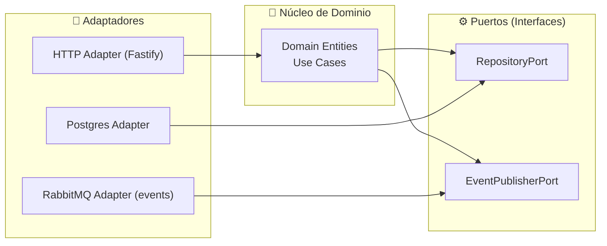

# Módulo 10 — Arquitectura Hexagonal y la aplicación de DDD

> **Objetivo:** comprender **por qué** y **cuándo** emplear el patrón, más allá del simple *how-to*.

---


## 1. Introducción a la arquitectura hexagonal

La Arquitectura Hexagonal surge en 2005 de la mano de **Alistair Cockburn** como respuesta a un reto constante: las reglas de negocio cambian con menor frecuencia que las tecnologías que las soportan. En entornos tradicionales, un monolito o una aplicación estratificada veían cómo cada actualización de framework, controlador de BD o cliente HTTP obligaba a modificar el núcleo de la aplicación. Cockburn propuso aislar la lógica de negocio en un “hexágono” rodeado de **puertos** (interfaces) y **adaptadores** (implementaciones), de modo que:

- El **dominio** permanece limpio, enfocado únicamente en las invariantes y reglas de negocio.  
- Los **cambios tecnológicos** (nueva versión de la base de datos, migración de REST a gRPC, etc.) se implementan en adaptadores sin tocar el núcleo.  
- El equipo gana **confianza** para refactorizar, sabiendo que el dominio está desacoplado y cubierto por tests rápidos.

Este enfoque también se conoció como **“Ports & Adapters”** y ha inspirado arquitecturas como Onion y Clean Architecture. A diferencia de éstas, Hexagonal enfatiza la simetría entre entradas y salidas del dominio, definiendo claramente cómo fluye la información hacia dentro y hacia fuera.

**Lecturas clave**:  
- Cockburn, “Ports and Adapters Architecture” – https://alistair.cockburn.us/hexagonal-architecture/  
- Uncle Bob, “The Clean Architecture” – https://blog.cleancoder.com/uncle-bob/2012/08/13/the-clean-architecture.html  
- Martin Fowler, “Microservices and Hexagonal Architecture” – https://martinfowler.com/articles/microservices.html

**Diagrama Conceptual**:



---

## 2. Principios de la arquitectura hexagonal

| Principio                         | Qué significa                                                   | Beneficio práctico                                                     |
|-----------------------------------|-----------------------------------------------------------------|-------------------------------------------------------------------------|
| Independencia del dominio         | El código de negocio no importa módulos de infraestructura.     | Refactors de infra sin tocar reglas de negocio; tests muy rápidos.      |
| Puertos explícitos                | Interfaces que definen entradas y salidas del dominio.          | Contratos claros; evita acoplamientos ocultos.                         |
| Adaptadores intercambiables       | Múltiples implementaciones de un mismo puerto.                  | Cambiar Mongo→Postgres o HTTP→gRPC sin modificar el dominio.            |
| Inversión de dependencias (DIP)   | El dominio declara abstracciones; la capa externa las implementa. | El dominio dicta la lógica, no la tecnología.                          |

---

## 3. Módulos de la arquitectura hexagonal

En un microservicio Node, la hexagonal suele aterrizar en cuatro módulos principales:

- **Dominio**: entidades, value objects, agregados y eventos (reglas + invariantes).
- **Aplicación**: casos de uso que orquestan el dominio y los puertos (sin detalles técnicos).
- **Puertos**: interfaces de entrada/salida que el core define (contratos).
- **Adaptadores**: implementaciones concretas (HTTP, DB, broker, APIs externas) + *wiring* (DI).

Regla práctica: si una clase “no compila” sin un framework (Fastify/Prisma), no debería estar en dominio.

## 4. Diferencias entre Arquitecturas: Clean vs Hexagonal vs Onion

| Dimensión       | Hexagonal                    | Onion                          | Clean Architecture             |
|-----------------|------------------------------|--------------------------------|--------------------------------|
| Núcleo          | Dominio + Aplicación         | Solo Dominio                   | Entidades + Casos de Uso       |
| Estructura      | Asimétrica (Ports & Adapters)| Capas concéntricas             | Capas concéntricas + políticas |
| Enfoque         | Aislar tecnología            | Pureza de dominio              | Casos de uso bien definidos    |
| Curva de inicio | Moderada                     | Elevada                        | Elevada                        |
| Ideal para      | Microservicios flexibles     | Dominios muy ricos             | Sistemas monolito/multi-UI     |

---

## 5. Beneficios en Microservicios Node.js

1. **Evolutividad:** inyectar nuevos adaptadores (REST, gRPC, CLI) sin tocar el core.  
2. **Testabilidad:** la mayor parte de la lógica se prueba en memoria, sin arranque de contenedores.  
3. **Observabilidad clara:** logs y métricas se configuran en adaptadores, manteniendo el dominio “limpio”.  
4. **Despliegue incremental:** puedo desplegar un nuevo adapter sin downtime para el dominio.

---

## 6. Ejemplo práctico: arrancando un servicio hexagonal

Durante la clase, usaremos un mini‑dominio “similar” al proyecto (reservar stock), pero **no** el mismo código: crearemos durante la sesión un mini‑proyecto en `curso/dia-02/ejercicios` con el **mismo stack del repo** (Node 20 + TypeScript + Fastify + Vitest).

```text
curso/dia-02/ejercicios/
├── src/
│   ├── domain/                 # core: invariantes y reglas
│   ├── application/            # core: casos de uso + puertos
│   ├── infrastructure/         # adapters: HTTP, in-memory, etc.
│   └── main.ts                 # bootstrap + wiring (Fastify)
└── test/
```

### 6.1 Localiza el “hexágono” en el código (mini-lab, 10 min)

Con el árbol anterior, responde:

1. ¿Qué ficheros pertenecen al **core** (dominio + aplicación)?
2. ¿Cuáles son adaptadores de **entrada** (driving) y cuáles de **salida** (driven)?
3. ¿Qué dependencias técnicas quedan “fuera” del core (HTTP server, almacenamiento en memoria, etc.)?

Pista rápida (para orientarte):

- Dominio: `curso/dia-02/ejercicios/src/domain/BookStock.ts`
- Caso de uso: `curso/dia-02/ejercicios/src/application/use-cases/ReserveCopiesUseCase.ts`
- Puertos: `curso/dia-02/ejercicios/src/application/ports/*`
- Entrada (HTTP): `curso/dia-02/ejercicios/src/main.ts` (Fastify)
- Salida (repo in-memory): `curso/dia-02/ejercicios/src/infrastructure/persistence/InMemoryBookStockRepository.ts`
- Salida (event publisher in-memory): `curso/dia-02/ejercicios/src/infrastructure/events/InMemoryEventPublisher.ts`

### 6.2 Definiendo un puerto (salida)

En el mini‑dominio, el repositorio es un puerto de salida (persistencia). El contrato lo **consume** el caso de uso y lo **implementa** la infraestructura:

```ts
// curso/dia-02/ejercicios/src/application/ports/BookStockRepositoryPort.ts (skeleton)
export interface BookStockRepositoryPort {
  getByBookId(bookId: BookId): Promise<BookStock | null>;
  save(stock: BookStock): Promise<void>;
}
```

### 6.3 Implementando un adaptador (salida)

En clase empezamos con un adaptador **in-memory** (rápido y sin infraestructura).

```ts
// curso/dia-02/ejercicios/src/infrastructure/persistence/InMemoryBookStockRepository.ts (skeleton)
export class InMemoryBookStockRepository implements BookStockRepositoryPort {
  // TODO: estructura interna (Map, etc.)
  async getByBookId(bookId: BookId): Promise<BookStock | null> { /* TODO */ }
  async save(stock: BookStock): Promise<void> { /* TODO */ }
}
```

### 6.4 Wiring (manual) en `main.ts`

```ts
// curso/dia-02/ejercicios/src/main.ts (idea)
const stockRepo = new InMemoryBookStockRepository();
const events = new InMemoryEventPublisher();
const reserveCopiesUseCase = new ReserveCopiesUseCase(stockRepo, events);
```

### 6.5 Caso de uso (aplicación) + adaptador HTTP (entrada)

Caso de uso: orquesta puertos + ejecuta reglas del dominio.

```ts
// curso/dia-02/ejercicios/src/application/use-cases/ReserveCopiesUseCase.ts (skeleton)
export class ReserveCopiesUseCase {
  constructor(
    private readonly stockRepo: BookStockRepositoryPort,
    private readonly events: EventPublisherPort
  ) {}

  async execute(command: { bookId: string; qty: number; reservationId: string }): Promise<void> {
    // TODO: validar invariantes (VO), cargar agregado, ejecutar regla, persistir, publicar evento
  }
}
```

Adaptador HTTP: valida “forma”, traduce a comando y delega en el caso de uso.

```ts
// curso/dia-02/ejercicios/src/main.ts (idea)
// POST /book-stock/:bookId/reserve { qty, reservationId }
app.post("/book-stock/:bookId/reserve", async (req, reply) => {
  // TODO: validar forma (body/params), delegar en use case, mapear error → status
  return reply.status(204).send();
});
```

### 6.6 Transfer al proyecto (últimos 30–45 min)

Una vez dominado el mini‑dominio, mapea 1:1 al proyecto:

- `BookId` → `SKU`
- `BookStock` → `ProductInventory`
- `ReserveCopiesUseCase` → `ReserveInventoryUseCase`
- repo in‑memory → repo Postgres (Prisma)
- publisher in‑memory → RabbitMQ adapter
- wiring manual → Awilix (DI)

Puntos de entrada del proyecto:

- `project/services/inventory-service/src/infrastructure/http/ProductInventoryRouter.ts`
- `project/services/inventory-service/src/application/ReserveInventoryUseCase.ts`
- `project/services/inventory-service/src/domain/value-objects/SKU.ts`

---

## 7. Convirtiendo microservicios a arquitectura hexagonal (guía práctica)

Un patrón común en equipos Node es partir de un servicio “framework‑first” (controladores grandes + repositorios mezclados) y evolucionar hacia un core estable. Un camino seguro:

1. **Identifica el caso de uso principal** (p. ej. `ReserveCopies`) y escribe su intención en 1 frase.
2. **Extrae el dominio**: entidades/VO con invariantes (sin HTTP/DB/broker).
3. **Define puertos** desde el core:
   - Salida (persistencia): `*RepositoryPort`.
   - Salida (eventos): `*EventsPort` / `EventPublisherPort`.
   - Entrada: el propio `UseCase` invocable desde HTTP/consumidores.
4. **Crea adaptadores finos**:
   - HTTP: valida/parsea, delega al Use Case, traduce errores a HTTP.
   - DB: implementa el `*RepositoryPort` con (Prisma/Postgres o lo que toque).
   - Mensajería: publica/consume eventos; añade idempotencia y *retry*.
5. **Introduce DI** (Awilix) y controla el *scope*:
   - Cliente DB como singleton; repositorios por request/scope.
6. **Asegura tests por capa**:
   - Dominio: unit tests sin I/O.
   - Aplicación: tests de Use Cases con dobles de puertos.
   - Infra: integración (DB/broker) y contract tests (si aplica).

> Regla de oro: el dominio debe poder evolucionar y testearse sin arrancar infraestructura.

---

## 8. Síntomas de mal implementación

- Adapters con lógica de negocio: rutas que validan reglas complejas o calculan totales.  
- Dominio importando librerías externas (axios, fs, etc.).  
- Tests de dominio que fallan si no hay una base de datos o broker disponible.  

> Regla de oro:  
> Si tu dominio necesita arrancar un contenedor para pasar un test, tu hexágono tiene fugas.  

---

## 9. Domain Objects y casos de uso

### 9.1 ¿Qué son los Domain Objects?

Son los objetos que expresan el modelo del dominio: **Entities**, **Value Objects**, **Aggregates** y, en algunos casos, **Domain Services**.

### 9.2 ¿Para que sirven los Domain Objects?

Para encapsular reglas e invariantes, reducir duplicidad de lógica y hacer que el código “hable” el lenguaje del negocio.

### 9.3 Creando nuestro primer Domain Object en un proyecto Node bajo un modelo de arquitectura hexagonal

Ejemplo (biblioteca): un `BookStock` con métodos intencionales (`reserve`, `release`, `replenish`) y **Value Objects** como `BookId` y `Quantity` que protegen invariantes.

```ts
// curso/dia-02/ejercicios/src/domain/BookId.ts (idea)
new BookId("BOOK-0001");

// curso/dia-02/ejercicios/src/domain/Quantity.ts (idea)
new Quantity(3);
```

### 9.4 ¿Qué son los casos de uso en la arquitectura hexagonal?

Son coordinadores de la capa de aplicación: implementan una intención (“Reservar stock”) y orquestan dominio + puertos (repos, bus de eventos, etc.).

### 9.5 ¿Para que sirven los casos de uso?

Para mantener los adaptadores finos (HTTP/consumers) y centralizar políticas de aplicación: transacciones locales, idempotencia, publicación de eventos y reglas de autorización.

### 9.6 Creación de proyecto Node bajo un modelo de arquitectura hexagonal

Estructura mínima recomendada:

```text
src/
  domain/
  application/
  infrastructure/
  main.ts
tests/
```

La idea es que el dominio y aplicación se puedan testear sin infraestructura real, y que la infraestructura sea intercambiable por adaptadores.
