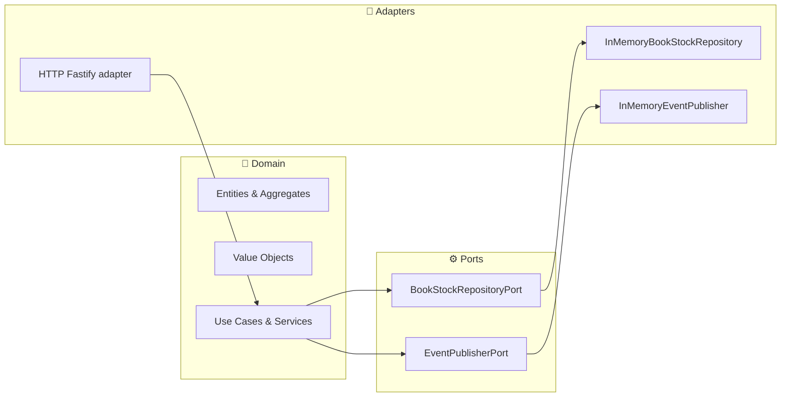

# Módulo 12 — Patrones de arquitectura en DDD: Puertos y Adaptadores

Objetivo: profundizar en la clasificación de puertos y adaptadores, su organización en Node.js y buenas prácticas para garantizar un acoplamiento mínimo y máxima testabilidad.

**Nota de contexto:**

- Un **Puerto** es una interfaz dentro de la capa de aplicación que define un contrato: _qué_ hace el sistema, sin detallar _cómo_.
- Un **Adaptador** es la implementación concreta de ese contrato, en la capa de infraestructura: _cómo_ interactúa con una base de datos, un broker de mensajes o un framework HTTP.

---

## 0. Arquitectura por capas vs arquitectura hexagonal (por qué importa)

Es habitual mezclar “arquitectura por capas” y “puertos/adaptadores”, así que conviene entender bien ambos enfoques.

- **Arquitectura por capas** (presentación → lógica → datos) organiza responsabilidades, pero puede terminar con dependencias “hacia abajo” que contaminan el dominio (si el dominio depende de ORM/HTTP).
- **Hexagonal** mantiene el dominio/aplicación en el centro y obliga a que la infraestructura dependa del core mediante puertos (DIP).

### 0.1 Capas: presentación, lógica empresarial y acceso de datos

- **Capa de presentación**: controladores/handlers (HTTP, CLI, consumidores) y mapeo de DTOs.
- **Capa de lógica empresarial**: casos de uso + dominio (reglas y decisiones).
- **Capa de acceso de datos**: persistencia e integraciones (DB, brokers, APIs externas).
- **Comunicación entre capas**: la presentación delega en la lógica; la lógica depende de abstracciones; los detalles (datos/infra) implementan esas abstracciones.

En la práctica:

- La **capa de presentación** suele ser un adaptador de entrada (HTTP/CLI/consumer).
- La **capa de acceso a datos** y mensajería suelen ser adaptadores de salida (DB/MQ/APIs externas).
- Los **Use Cases** (aplicación) coordinan puertos y ejecutan reglas de negocio sin detalles técnicos.

## 1. Taxonomía de puertos y adaptadores

| Tipo                 | Alias                | Definido en                   | Ejemplos                                     |
| -------------------- | -------------------- | ----------------------------- | -------------------------------------------- |
| Puerto de Entrada    | Driving / Primary    | Capa de aplicación            | RegisterUserCommand, GetOrderQuery           |
| Puerto de Salida     | Driven / Secondary   | Capa de aplicación            | UserRepositoryPort, PaymentGatewayPort       |
| Adaptador de Entrada | Controller / Handler | Infraestructura (HTTP, CLI)   | FastifyHandler, GraphQLResolver, CLIParser   |
| Adaptador de Salida  | Gateway              | Infraestructura (DB, MQ, API) | PostgresUserRepository, StripePaymentGateway |

### 1.1 Puertos de entrada y salida en la arquitectura hexagonal

- **Puerto de entrada**: define cómo “se invoca” un caso de uso (desde HTTP, CLI o consumo de eventos).
- **Puerto de salida**: define cómo el caso de uso interactúa con dependencias externas (repositorio, bus de eventos, terceros).

### 1.2 ¿Cómo se relacionan los puertos con los Domain Object y los casos de uso?

- Los **Domain Objects** viven en dominio (entidades/VO/agregados) y representan reglas e invariantes.
- Los **casos de uso** viven en aplicación y orquestan Domain Objects.
- Los **puertos** son el pegamento: el caso de uso se define como puerto de entrada y consume puertos de salida para persistir/publicar/integrar.

### 1.3 Creando un puerto de entrada y salida en un proyecto Node bajo un modelo de arquitectura hexagonal

Ejemplo mínimo (entrada + salida), para el mini‑dominio en `curso/dia-02/ejercicios`:

```ts
// application/ports/ReserveCopiesPort.ts (puerto de entrada, opcional)
export type ReserveCopiesCommand = { bookId: string; qty: number; reservationId: string };
export interface ReserveCopiesPort {
  execute(command: ReserveCopiesCommand): Promise<void>;
}

// application/ports/BookStockRepositoryPort.ts (puerto de salida)
export interface BookStockRepositoryPort {
  getByBookId(bookId: BookId): Promise<BookStock | null>;
  save(stock: BookStock): Promise<void>;
}
```

### 1.4 Tipos de adaptadores en la arquitectura hexagonal

- **Adaptadores de entrada**: reciben “intenciones” (HTTP, CLI, consumers) y traducen a comandos/queries del core.
- **Adaptadores de salida**: implementan puertos para infraestructura (DB, broker, APIs externas, cache).
- **Adaptadores de traducción**: *mappers/ACL* entre modelos cuando integras bounded contexts (evita acoplamiento).

## 2. Diagrama conceptual (Mermaid)



## 3. Ejemplo (en clase): puertos de salida (repo + eventos)

### 3.1. Puerto de persistencia (repo)

En ejercicios (con el mismo stack del repo), los puertos están en TypeScript:

- `curso/dia-02/ejercicios/src/application/ports/BookStockRepositoryPort.ts`
- `curso/dia-02/ejercicios/src/application/ports/EventPublisherPort.ts`

### 3.2. Adaptadores in-memory (implementación de puertos)

- Repo (persistencia): `curso/dia-02/ejercicios/src/infrastructure/persistence/InMemoryBookStockRepository.ts`
- Publisher (eventos): `curso/dia-02/ejercicios/src/infrastructure/events/InMemoryEventPublisher.ts`

Micro-reto (5 min): abre `ReserveCopiesUseCase` y decide qué es “contrato estable” del evento `CopiesReserved`:

- `event.type`
- nombres/campos de `payload`
- versionado del evento (si lo añades, ¿dónde vive?)

## 4. Adaptador de entrada: HTTP Handler

```typescript
// curso/dia-02/ejercicios/src/main.ts (idea)
// - valida forma (JSON, campos requeridos)
// - delega en el Use Case
// - traduce error a HTTP
//
// POST /book-stock/:bookId/reserve { qty, reservationId }
```

Checklist “thin HTTP adapter”:

- Valida forma (requeridos/tipos) y traduce a un comando.
- Llama al Use Case (nada de lógica de stock aquí).
- Traduce errores del core a HTTP (códigos estables).

## 5. Inversión de Dependencias (DIP) en main.ts

```typescript
// curso/dia-02/ejercicios/src/main.ts (idea)
export function buildContainer() {
  // wiring explícito, sin magia
  return { stockRepo, events, reserveCopiesUseCase };
}
```

## 6. Anti-patrones comunes

| Anti-patrón         | Riesgo                                  | Solución recomendada                        |
| ------------------- | --------------------------------------- | ------------------------------------------- |
| Fat Adapter         | Mezcla lógica de negocio en controllers. Ver Punto 4. | Extraer lógica a UseCases / Domain Services |
| Domain (Head Up Display) HUD          | Logging/tracing directo en entidades    | Inyectar un LoggerPort en adaptadores       |
| Anonymous Interface | Usar any para puertos, perdiendo tipado | Definir interfaces específicas y pequeñas   |

## 7. Buenas prácticas

1. Puertos “skinny”: interfaces de 1–3 métodos con responsabilidad clara.
2. Adaptadores “thin”: realizan validación y mapeo de DTOs ↔ entidades; toda la lógica de negocio permanece en el dominio o en Use Cases.
3. Use Cases orquestan: coordinan puertos, adaptadores y emisión de eventos, evitando lógica dispersa.
4. Tests unitarios de adapters: verificar que un adapter cumple el contrato en memoria sin necesidad de servicios externos.

### Ejemplo de test unitario para un adapter de salida

En ejercicios, los tests son con Vitest (igual que en `project/services/*`):

- `curso/dia-02/ejercicios/test/domain.test.ts`
- `curso/dia-02/ejercicios/test/reserve-usecase.test.ts`

Mini-reto (10 min): lee ese test y responde:

1. ¿Qué se testea en dominio (sin puertos)?
2. ¿Qué se testea en aplicación (con dobles de puertos)?

---

## 8. Segregación de responsabilidad entre comandos y consultas (CQRS)

Una fuente común de acoplamiento es “un endpoint que hace de todo”: valida, cambia estado, consulta y compone respuestas complejas. Esto se suele formalizar como **segregación de comandos y consultas**.

- **Command**: intención de cambiar estado (p. ej. `ReserveCopies`).
  - Devuelve `204/202` o un *resource id*, pero evita devolver grandes lecturas.
- **Query**: intención de leer estado (p. ej. `GetBookStockById`).
  - No cambia estado; puede optimizarse con caché/proyecciones.

En hexagonal, lo habitual es:

- Commands → Use Case (puerto de entrada) → puertos de salida (repo/bus) → persistencia/eventos.
- Queries → Query handler (puerto de entrada) → repos de lectura / read models.

---

## 9. Scope (ciclo de vida) y DI en microservicios

El *scope* evita fugas de estado y reduce bugs difíciles:

- **Singleton**: clientes (PrismaClient, RabbitMQ connection) y *SDKs* compartidos.
- **Scoped/per-request**: repositorios/adaptadores que dependen del request o de un “unit of work”.
- **Transient**: objetos sin estado (mappers, factories pequeñas).

Regla práctica: si una dependencia mantiene estado mutable, evita que sea singleton salvo que esté diseñada para ello.

---

## 10. Transfer al proyecto (al final de la sesión)

Cuando el patrón esté claro en `curso/dia-02/ejercicios`, lo llevamos al proyecto:

- `BookId` → `SKU`
- `BookStock` → `ProductInventory`
- `ReserveCopiesUseCase` → `ReserveInventoryUseCase`
- InMemory repo/publisher → Postgres + RabbitMQ
- HTTP (Fastify) → Fastify router (mismo concepto, distinto contexto)

Puntos de entrada del proyecto para hacer el “swap”:

- `project/services/inventory-service/src/infrastructure/http/ProductInventoryRouter.ts`
- `project/services/inventory-service/src/application/ReserveInventoryUseCase.ts`
- `project/services/inventory-service/src/domain/value-objects/SKU.ts`
