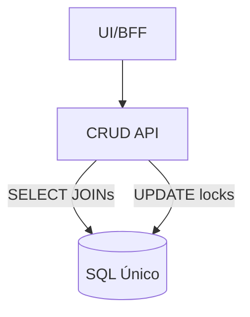
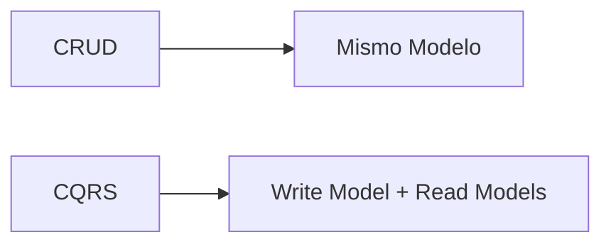
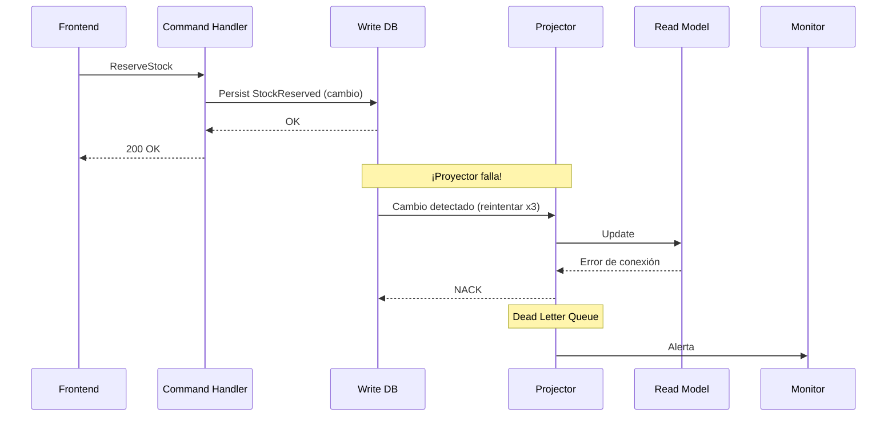
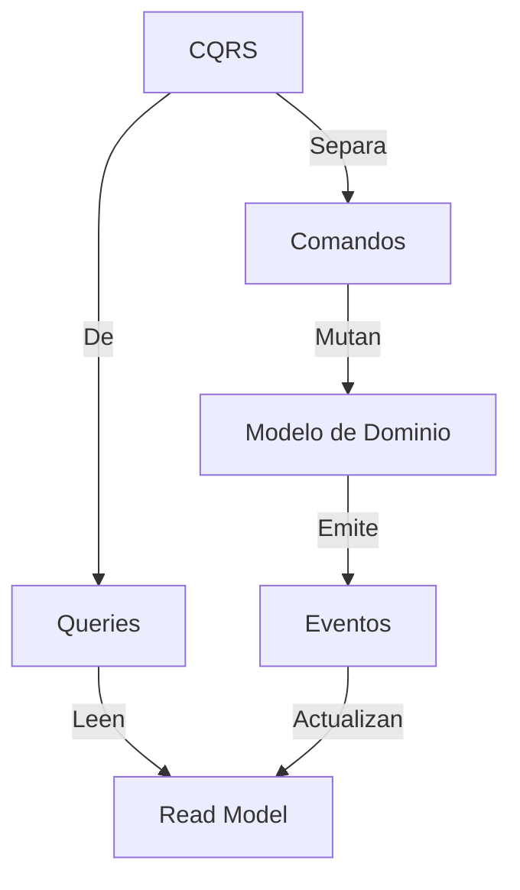

# Módulo 4 — Escalabilidad y rendimiento: CQRS (fundamentos)

En este primer bloque de **CQRS** nos centraremos en los fundamentos esenciales que toda arquitectura debe contemplar antes de incorporar patrones más avanzados. Sin rodeos, analizaremos por qué dividir lecturas y escrituras, cómo se relacionan sus componentes clave y cómo se materializa este enfoque en un ejemplo real de dominio.

Conexión con lo anterior: ya tenemos un modelo de escritura con invariantes (agregados + use cases) y eventos que expresan “qué pasó”. CQRS aprovecha justo esa base: **escrituras coherentes** en el dominio y **lecturas rápidas** mediante vistas/proyecciones.
 
## 0. Dinámica Inicial: "El Dilema del Modelo Único"
**Actividad Grupal**:  

**Escenario de partida:**
Imaginemos que estamos diseñando la arquitectura backend para una plataforma de reservas de hoteles con 500.000 usuarios activos al día.

**Actualmente, manejamos:**
- 10.000 búsquedas por minuto (filtros complejos: ciudad, fecha, disponibilidad, precio, promociones, etc.)
- 200 reservas por minuto (creación de registros, bloqueo de habitación, transacciones, notificaciones)

**Problemas a resolver:**
- Todo está bajo un modelo de datos único.
- Usamos un enfoque clásico de repositorios CRUD sobre una única base de datos relacional.
- La empresa quiere añadir un nuevo tipo de habitación: “habitaciones premium”, con políticas de disponibilidad distintas y reglas específicas de validación.

**Preguntas a responder:**
1. ¿Qué problemas anticipan en términos de rendimiento, escalabilidad o mantenimiento?
2. ¿Qué riesgos existen si queremos escalar solo el sistema de consultas?
3. ¿Cómo afectaría una migración de esquema para añadir "habitaciones premium"?

---

## 1. Fundamentos Conceptuales

### 1.1 Anatomía de un Cuello de Botella
**Demostración Visual**:  

- **Problema 1**: Bloqueos por escrituras largas (ej: validación de stock) retrasan lecturas críticas.  
- **Problema 2**: Índices optimizados para reportes ralentizan transacciones (trade-off físico).  

**Caso Real**:  
- *Ejemplo Twitter*: En 2012, su API de escritura (tweets) y lectura (timelines) colisionaban, requiriendo partición gradual.

### 1.2 Uso de patrón CQRS  
**Metáfora**:  
- *Cocina de restaurante*:  
  - **Command Side**: Chef (escribe) organiza estaciones para eficiencia en preparación.  
  - **Query Side**: Mesero (lee) tiene menú desnormalizado para respuestas rápidas.  

**Principios Técnicos**:  
- **Segregación por Modelo**:  
  - **Write Model**: Agregados DDD + invariantes (ej: `InventoryAggregate.reserve()`).  
  - **Read Model**: Vistas específicas por caso de uso (ej: `StockDashboardView`).  

**Diagrama Comparativo**:  


### 1.3 No Todo es Oro: Trade-offs 
**Discusión Guiada**:  
- ✅ Ventajas:  
  - Escalabilidad independiente (ej: Redis Cache para queries, Kafka para eventos).  
  - Modelos especializados (ej: GraphQL para móvil, SQL para backoffice).  
- ❌ Desventajas:  
  - Complejidad eventual: Consistencia, sincronización de modelos.  
  - Sobrecarga en despliegues (ej: Mantener 3 read models en MongoDB, ES, etc).  

---

## 2. Arquitectura de Referencia

### 2.1 Componentes Clave con Responsabilidades 
**Deep Dive**:  
- **Command Handler**:  
  - Valida permisos, carga agregados, ejecuta lógica.  
  - **Código Ejemplo**:  
    ```typescript
    class ReserveStockHandler {
      async execute(command) {
        // 1. Validación de formato
        if (!command.payload.items) throw new InvalidCommandError();
        
        // 2. Carga estado actual
        const order = await repo.load(command.orderId);
        
        // 3. Invoca dominio
        order.reserve(items);
        
        // 4. Persiste y publica
        await repo.save(order);
        await eventBus.publish(order.events);
      }
    }
    ```
- **Persistencia del Write Model**:  
  - Base de datos transaccional donde se guardan cambios del lado de comandos (PostgreSQL, MySQL, etc.).  
  - Desde aquí se derivan proyecciones/read models para optimizar lecturas (CQRS).  

### 2.2 Flujo End-to-End con Casos de Error 
**Secuencia con Fallos**:  

- **Mecanismos de Resiliencia**:  
  - Reintentos exponenciales en proyectores.  
  - Dead Letter Queues + Monitorización.  
  - Reconstrucción de Read Models desde la fuente de cambios (write DB).

---

## 3. Ejemplo Práctico: Dominio *InventoryOrder*

### 3.1 Live Coding: De CRUD a CQRS (10 min)  
**Antes (CRUD)**:  
```typescript
// Servicio monolítico
class InventoryService {
  async reserveStock(orderId, items) {
    const tx = await db.startTransaction();
    
    try {
      // 1. Bloquea filas
      const stock = await tx.query('SELECT * FROM stock WHERE sku IN (...) FOR UPDATE');
      
      // 2. Valida y actualiza
      items.forEach(item => {
        if (stock.find(s => s.sku === item.sku).available < item.qty) 
          throw new Error('Stock insuficiente');
        stock.reserved += item.qty;
      });
      
      // 3. Actualiza múltiples tablas
      await tx.update('stock', stock);
      await tx.insert('reservations', { orderId, items });
      
      await tx.commit();
    } catch (err) {
      await tx.rollback();
    }
  }
}
```
**Problemas Identificados**:  
- Bloqueos de largo alcance (FOR UPDATE).  
- Acoplamiento entre reservas y consultas.  

**Después (CQRS)**:  
```typescript
// Command Side
class ReserveStockCommandHandler {
  constructor(private repo, private eventBus) {}
  
  async execute(command) {
    const order = await this.repo.load(command.orderId);
    order.reserve(command.items);
    await this.repo.save(order);
    await this.eventBus.publish(order.events);
  }
}

// Read Side (Proyección)
class StockProjector {
  constructor(private readDb) {}
  
  async onStockReserved(event) {
    // Actualización eventualmente consistente
    await this.readDb.collection('stock').updateMany(
      { sku: { $in: event.items.map(i => i.sku) } },
      { $inc: { reserved: item.qty } }
    );
  }
}
```

### 3.2 Simulación de Escalabilidad  
**Escenario**:  
- 100k reservas/hora vs 5M consultas de stock/día.  

**Configuración en AWS**:  
- **Command Side**:  
  - Lambda + DynamoDB (write DB) + Reserved Concurrency.  
- **Query Side**:  
  - API Gateway + ElasticCache (Redis) con TTL de 10 segundos.  
  - ElasticSearch para búsquedas complejas.  

**Métrica Clave**:  
- Escrituras: 500 ms/op (consistencia fuerte).  
- Lecturas: 5 ms/op (consistencia eventual).  

### 3.3 Discusión de Patrones Relacionados  
- **Sagas**: Coordinación entre agregados vía eventos.  
- **Caching Strategies**:  
  - **Write-Through**: Actualiza cache en comandos.  
  - **Refresh-Ahead**: Pre-calcula consultas frecuentes.  

---

## 4. Cierre y Preparación para la Próxima Sesión (5 min)  

- **Resumen Visual**:  
  ```mermaid
  journey
    title Ciclo de Vida CQRS
    section Comando
      Command Handler: 5: Ejecuta
      Write DB: 3: Persiste
    section Consulta
      Read Model: 5: Responde
      Projector: 3: Actualiza
  ```

- **Diagrama de CQRS**:


**Evaluación Rápida y ejercicios**:  
- 3 Preguntas Rápidas (Kahoot!):  
  1. ¿Qué componente maneja la lógica de negocio en CQRS?  
  2. ¿True or False?: CQRS implica modelos distintos para lecturas y escrituras.  
  3. Nombra tres ventajas de separar modelos de lectura/escritura.  

---

## 5. Introducción a las técnicas de escalado más habituales

CQRS es una herramienta potente, pero no es la única. En microservicios solemos combinar:

### 5.1 ¿Cómo detectar problemas de escalado?

- **Latencia** (P95/P99) creciendo con RPS estable.
- **Saturación**: CPU al 90–100%, *event loop lag*, conexiones DB agotadas.
- **Errores**: aumento de `5xx`, *timeouts* y *retries*.
- **Backlogs**: colas creciendo (broker), *consumer lag*.

### 5.2 Estrategias de escalabilidad horizontal y vertical

- **Horizontal**: más réplicas del servicio + balanceo → el camino habitual.
- **Vertical**: más CPU/RAM → útil para estabilizar, pero tiene techo y coste.

### 5.3 Uso de Base de Datos de Replicación

- Read replicas + *routing* de consultas.
- Read models especializados (proyecciones) para endpoints calientes.

### 5.4 Implementación de caché en microservicios

- Caché por endpoint/route (TTL) para lecturas repetidas.
- Caché de dominio (con invalidación) para agregados con alta lectura.
- Ojo: caché sin *observabilidad* = bugs invisibles.

### 5.5 Uso de Lambdas para demandas de uso no continuas

- Para picos (campañas), mover procesamiento pesado a workers o funciones.
- Mantén idempotencia y trazabilidad (reintentos).

### 5.6 Uso de balanceadores de carga en microservicios

- Load balancers + *rate limiting*.
- *Bulkheads* y colas internas para absorber picos sin colapsar el core.

### 5.7 Técnicas de optimización de rendimiento en microservicios

- Optimiza I/O antes que CPU: índices, *query plans*, *pooling* y reducción de *chatty calls*.
- Reduce payloads: paginación, campos selectivos, compresión y formatos eficientes cuando aplica (p. ej. Protobuf).
- Evita “N+1 calls” entre servicios: composición en gateway/BFF o proyecciones (CQRS).
- Perf en Node: profiling (clinic/0x), `event loop lag`, uso de streams y evitar CPU‑bound en el loop (workers).

### 5.8 Monitoreo y ajuste de recursos en entornos de microservicios

- Métricas de saturación (CPU, memoria, conexiones DB, backlog de colas) + latencias P95/P99.
- Alertas por SLO (no solo “CPU alta”): *error rate*, *burn rate*, colas creciendo y *timeouts*.
- Ajuste de límites: requests/limits (k8s), *autoscaling* por CPU/RPS o por *queue depth* (KEDA), *connection pools*.

### 5.9 Aplicando técnicas de escalado en proyectos Node

- Escala horizontal: múltiples réplicas + balanceador; evita estado en memoria (o externalízalo).
- CPU‑bound: `worker_threads` o jobs; no bloquees el event loop (PDF, cifrado, compresión).
- Concurrencia controlada: límites de `pool`, *bulkheads*, *rate limiting* y backpressure.

---
