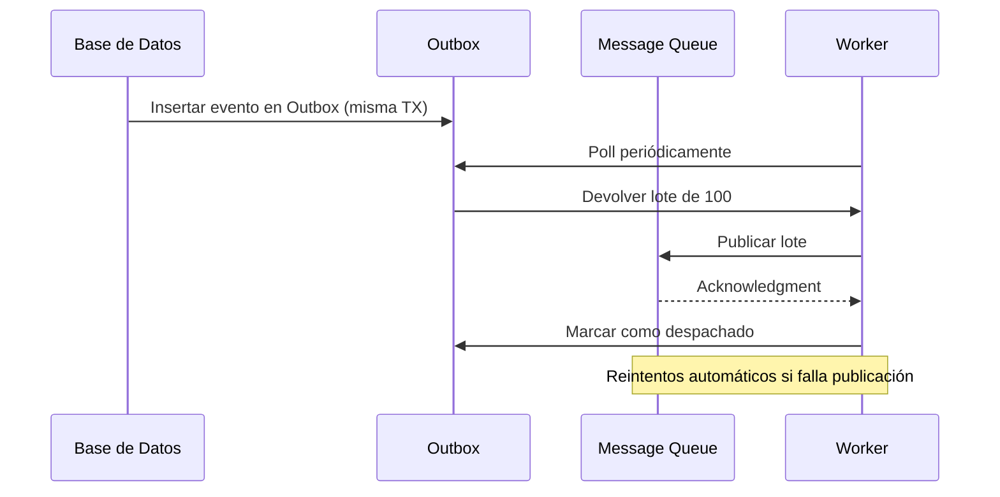

# Módulo 13 — Patrones de comunicación en DDD: traducción, Outbox, Sagas y Process Managers

En esta sesión trabajamos los patrones que permiten integrar bounded contexts y procesos distribuidos con bajo acoplamiento: **traducción de modelos**, **bandeja de salida (outbox)**, **sagas** y **gestión de procesos (process managers)**. Son piezas que suelen complementar microservicios y CQRS, pero no dependen de una técnica de persistencia concreta.

---

## 1. Traducción de modelos entre bounded contexts

Cuando un servicio consume datos/eventos de otro, rara vez puede “importar el modelo” sin pagar acoplamiento. Esto se suele resolver con **traducción de modelos**.

### 1.1 Traducción de modelos sin estado (stateless translation)

El adaptador traduce **payload → comando interno** sin recordar nada.

- Entrada: evento externo `OrderCompletedV2`.
- Salida: comando interno `RegisterPaymentCommand`.
- Se implementa como *mapper/anti-corruption layer* (ACL) en infraestructura o aplicación.

Ventaja: simple y fácil de escalar. Riesgo: si el flujo requiere correlación temporal, se queda corto.

### 1.2 Traducción de modelos con estado (stateful translation)

Cuando necesitas correlación y pasos (p. ej. “esperar 2 eventos para confirmar”), introduces estado:

- **Saga / Process Manager**: mantiene progreso, timeouts y reintentos.
- Persiste estado en una tabla (p. ej. `payment_saga_state`) para recuperación tras fallos.

Ventaja: coordina procesos largos. Riesgo: aumenta complejidad; exige idempotencia y observabilidad.

## 2. Bandeja de salida (Outbox Pattern): implementación robusta

El patrón Outbox desacopla la transacción de la base de datos de la publicación de eventos, garantizando **no pérdida** (durabilidad) y una entrega **al menos una vez**. La “exactly-once” real se consigue de forma práctica con **idempotencia/deduplicación** en consumidores.

### 2.1 Diagrama de Secuencia con Fallos



Este flujo asegura que ningún evento quede sin publicar; asume que puede haber duplicados y los resolvemos con idempotencia.

**Requisitos Clave**:

1. Entrega al menos una vez + deduplicación en consumidores.
2. Gestión de desconexiones de MQ.
3. Registro de métricas: eventos procesados, latencia.
4. Priorización basada en `payload.metadata.priority`.

---

## 3. Saga

Los Sagas coordinan transacciones distribuidas garantizando consistencia eventual. Veremos patrones de circuit breaker, timeouts y cómo orquestar flujos complejos.

### 3.1 Patrón Circuit Breaker en Sagas

El circuit breaker previene escaladas de error. Ante fallos transitorios, ejecutamos reintentos; si persisten, lanzamos compensaciones.

### 3.2 Implementación con Retroceso

```ts
class PaymentSaga {
  async run(orderId: string) {
    try {
      await payOrder(orderId);
      await reserveStock(orderId);
    } catch (error) {
      if (isTransient(error)) {
        throw new SagaRetryError(); // Reintentar más tarde
      }
      await this.compensate(orderId); // Deshacer cambios
    }
  }
  private async compensate(orderId: string) {
    await cancelPayment(orderId);
    await releaseStock(orderId);
    await markOrderAsFailed(orderId);
  }
}
```

Este patrón asegura que, si la reserva de stock falla tras el pago, revertimos la transacción completa.

---

## 4. Gestión de procesos (Process Managers): caso avanzado

Los Process Managers mantienen estado intermedio y gestionan timeouts, ideal en flujos con múltiples dependencias y plazos.

### 4.1 Estado Complejo con Timeouts

```ts
interface SagaState {
  id: string;
  steps: {
    payment: 'pending' | 'completed' | 'failed';
    inventory: 'pending' | 'reserved' | 'released';
    shipping: 'not_started' | 'scheduled';
  };
  expiresAt: Date;
  retries: number;
}

class SagaTimeoutHandler {
  async checkExpired() {
    const expired = await db.query(
      `UPDATE sagas SET status='expired' WHERE expires_at < NOW() AND status='running' RETURNING *`
    );
    expired.rows.forEach(saga => this.compensate(saga));
  }
}
```

Este componente detecta sagas que superaron su plazo y aplica compensaciones.

---

## 5. Tolerancia a fallos y resiliencia en microservicios

Cuando introduces eventos, sagas y outbox, también introduces fallos inevitables. A continuación, una guía operacional alineada a microservicios.

### 5.1 Implementación de circuit breakers y fallbacks

- Aplica **circuit breaker** en dependencias externas (pagos, terceros) para cortar cascadas de fallos.
- Define **fallbacks** explícitos: degradar funcionalidad (p. ej. modo “solo lectura”) o encolar para procesar después.

### 5.2 Manejo de fallas y errores en microservicios

- Clasifica errores en **transitorios** (reintentables) vs **permanentes** (a DLQ/incidencia).
- Normaliza códigos y tipos de error en contratos (HTTP y eventos) para que los consumidores reaccionen consistentemente.

### 5.3 Estrategias de recuperación y reintentos en microservicios

- **Retries con backoff + jitter** solo si la operación es idempotente.
- Introduce **bulkheads** (aislamiento) y límites de concurrencia para estabilizar bajo presión.
- En asíncrono: reintentos + TTL + DLQ como “válvula de seguridad” ante mensajes venenos.

### 5.4 Pruebas de resiliencia y recuperación en microservicios

- *Resilience tests*: simular caídas de broker/DB, latencia, duplicados y reordenamiento.
- Verificar recuperación: reprocesar desde DLQ, reconstruir proyecciones, *replay* controlado.

### 5.5 Diseño de sistemas anti-fragiles en microservicios

- Diseña para aprender de fallos: métricas, alertas accionables, DLQ observable y runbooks.
- “Anti‑frágil” implica que cada incidente deja el sistema **más robusto** (mejoras estructurales, no solo parches).
