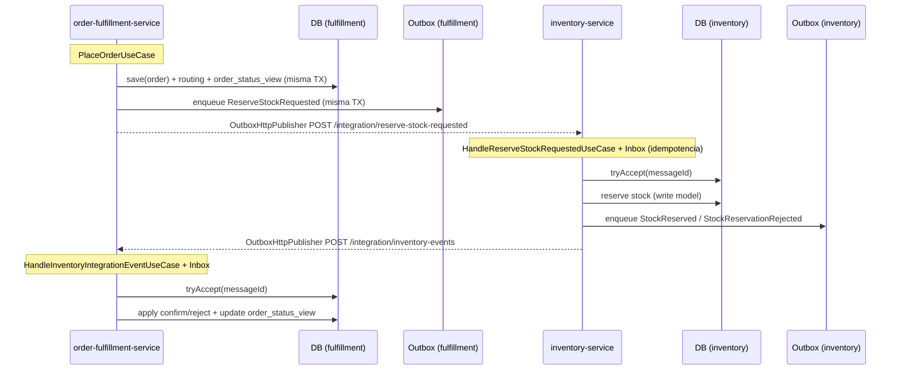

# Sesión 8 · Jueves 19-feb-2026

## Repaso exprés de la Sesión 7

| Concepto clave                            | ¿Qué vimos?                                                                                                                                                                 |
| ----------------------------------------- | --------------------------------------------------------------------------------------------------------------------------------------------------------------------------- |
| **Outbox Pattern**                        | Técnica para garantizar la publicación fiable de eventos desde la base de datos, usando una tabla `outbox` y un proceso que los envía de forma asíncrona.                   |
| **Process Manager (o Saga orchestrator)** | Componente que coordina pasos de largo recorrido entre servicios, manteniendo estado y reaccionando a eventos como `StockReserved` o `StockReservationRejected`.            |
| **Métricas en Sagas**                     | Explicamos cómo instrumentar métricas como `saga_failed_total` para monitorear fallos en la ejecución distribuida de pasos.                                                 |
| **Estados intermedios en la Saga**        | Definición y gestión de estados como `RESERVATION_PENDING`, `RESERVED`, `REJECTED` y marcas de inventario reservado/liberado.                                               |
| **Errores y compensaciones**              | Tipos de fallos en Sagas y estrategias para compensarlos (undo/compensating actions), resaltando la necesidad de diseño explícito para el fracaso.                          |
| **Reintentos en entrega de eventos**      | Introducción al concepto de retry/back-off y su papel en garantizar la eventual consistencia ante errores temporales en la entrega de eventos.                              |

### El flujo que dejamos listo (en el proyecto)

En el proyecto del curso (`project/`), el flujo distribuido de la sesión 7 queda así:

