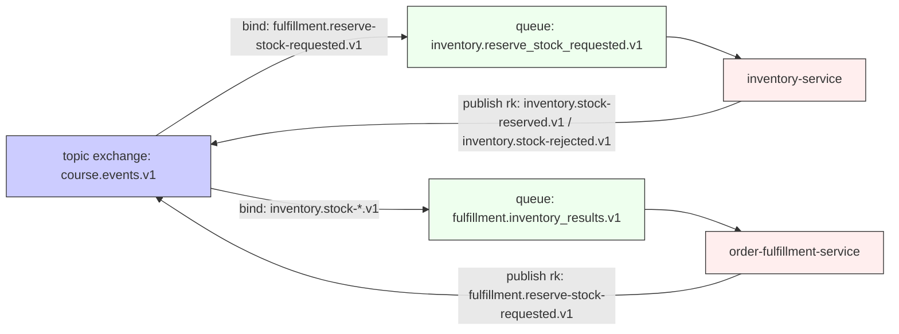

# Sesión 8 · Jueves 19-feb-2026
**Duración:** 16:00 – 19:00
**Tema global:** *Patrones y buenas prácticas en microservicios: eventos, mensajería y pub/sub (EDA)*

**Temario (referencia):**
- [6 · Patrones y buenas prácticas en microservicios](../../NUEVO_TEMARIO.md#6-patrones-y-buenas-prácticas-en-microservicios)
  - Patrón de diseño de agregados
  - Patrón de diseño de eventos y mensajes
  - Patrón de diseño de gateway y API composition
  - Patrón de diseño de publicación-suscripción
  - Buenas prácticas en la implementación y gestión de microservicios
  - Recomendaciones de seguridad en microservicios
- [3 · Comunicación y descubrimiento de servicios](../../NUEVO_TEMARIO.md#3-comunicación-y-descubrimiento-de-servicios)
  - Protocolos y formatos de intercambio de datos en microservicios
  - Uso de herramientas de descubrimiento y registro de servicios
  - Implementación de APIs y contratos de servicio

## Objetivos y agenda

| Actividad                                 | Salida esperada                      |
| ----------------------------------------- | ------------------------------------ |
| **EDA fundamentos**                       | Comprender Event Brokers & Streams   |
| **EDA en Node.js**                        | Publicar/consumir con confirmSelect  |
| **Errores y retries**                     | Estrategia back-off + DLX lista      |
| Practicar                                 | Ejemplos prácticos y ejercicios      |
| Quiz #08                                  | Validación rápida                    |

---

## Agenda (3h)

| Hora | Bloque | Contenido |
|------|--------|-----------|
| 16:00–16:10 | Repaso | Qué venimos construyendo y por qué EDA ahora. |
| 16:10–16:40 | EDA fundamentos | Evento vs mensaje, pub/sub y trade-offs. |
| 16:40–17:10 | RabbitMQ essentials | Exchanges, routing keys, colas, ack y concurrencia. |
| 17:10–17:20 | Descanso | Pausa breve. |
| 17:20–17:50 | Errores y retries | Reintentos, DLX/DLQ y mensajes “poison”. |
| 17:50–18:25 | Contratos y evolución | Versionado, tolerant reader y compatibilidad. |
| 18:25–19:00 | Taller | Publicación/consumo + simulación de fallos. |

---

## Aplicado al proyecto del curso (continuación del día 7)

En día 7 cerramos un flujo distribuido entre:

- `project/order-fulfillment-service/` (publica `ReserveStockRequested`, consume resultados)
- `project/inventory-service/` (consume `ReserveStockRequested`, publica resultados)

En día 8 damos el siguiente paso: **sustituir el transporte HTTP “punto a punto” por pub/sub real con un broker** (RabbitMQ), manteniendo:

- Outbox (durabilidad de publicación)
- Inbox/idempotencia (consumidores tolerantes a duplicados)
- Contratos versionados (Published Language)

### Contrato mínimo (mensaje) — ejemplo alineado con el proyecto

> Nota: “evento” = `event`; “mensaje” = envelope con `messageId`/`correlationId`.

```ts
type IntegrationEvent<TType extends string, TPayload> = Readonly<{
  type: TType
  version: 1 | 2
  occurredAt: string // ISO
  payload: TPayload
}>

type IntegrationMessage<TEvent extends IntegrationEvent<string, unknown>> = Readonly<{
  messageId: string
  correlationId: string
  event: TEvent
}>
```

### Topología RabbitMQ propuesta (para el taller)


