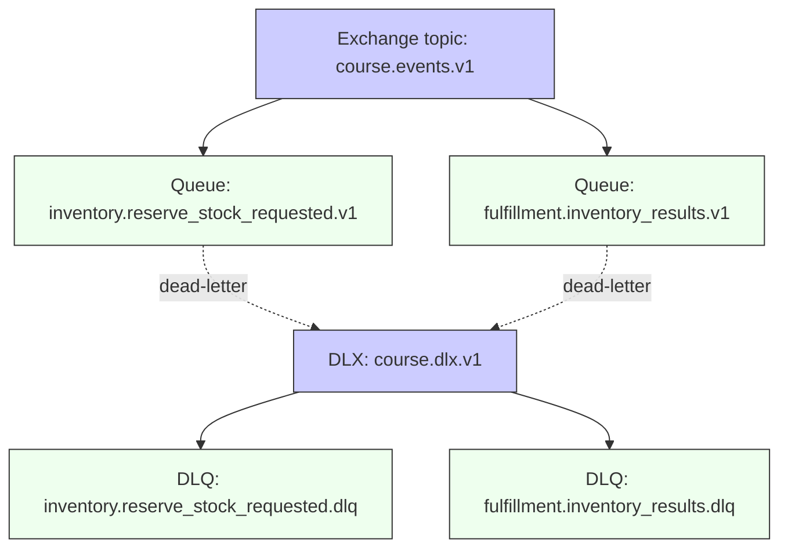

# Avance del proyecto · Sesión 8 — EDA (mensajería)

## Meta hasta la sesión 9

- Identificar oportunidades de mejora en el proyecto aplicando EDA (eventos de dominio).
- Practicar publicación/consumo con RabbitMQ (exchanges, colas, bindings).
- Definir estrategia de errores: retry + DLQ + métricas.

---

## Tareas sugeridas

1. Definir el contrato de evento (mínimo viable)
   - `type`, `version`, `timestamp`, `correlationId`, `payload`.
2. Acordar topología RabbitMQ del proyecto
   - Exchanges (topic), routing keys y colas por bounded context.
3. Implementar un consumer real en un servicio
   - Validación de schema + idempotencia.
4. Configurar DLQ
   - Retry con backoff + dead-letter para mensajes no procesables.
5. Observabilidad
   - Métricas: `messages_published_total`, `messages_consumed_total`, `consumer_errors_total`, `dlq_messages_total`.

---

## Aplicado al proyecto del curso (desde día 7)

Partimos del estado actual en `project/` (fin día 7):

- `order-fulfillment-service` publica `ReserveStockRequested` usando Outbox + polling (hoy por HTTP).
- `inventory-service` consume ese mensaje y publica resultados (`StockReserved` / `StockReservationRejected`), también con Outbox + idempotencia.

En esta sesión, el avance recomendado es **mantener Outbox/Inbox tal cual** y cambiar el transporte:

1) **Outbox Publisher → RabbitMQ** (en vez de `fetch(...)` a un HTTP endpoint)  
2) **Consumers desde RabbitMQ** (ack/nack + prefetch)  
3) **DLX/DLQ** para mensajes “poison” y reintentos

### Topología mínima sugerida (RabbitMQ)

### Referencias concretas al repo

Contratos del proyecto:

- `project/artifacts/03-integration-contracts.md`

Productor de `ReserveStockRequested` (estado objetivo):

- `project/order-fulfillment-service/src/infra/events/OutboxIntegrationEventPublisher.ts`
- `project/order-fulfillment-service/src/infra/events/OutboxRabbitPublisher.ts`

Consumidor de `ReserveStockRequested` (estado objetivo):

- `project/inventory-service/src/infra/messaging/ReserveStockRequestedRabbitConsumer.ts`
- `project/inventory-service/src/application/HandleReserveStockRequestedUseCase.ts`

En día 8, el objetivo es que esas “puntas” HTTP se sustituyan por consumidores/productores RabbitMQ, manteniendo el núcleo (use cases + inbox/outbox) intacto.
