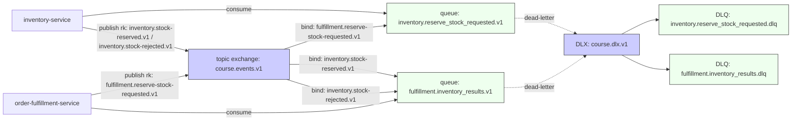

# Sesión 9 · Martes 24-feb-2026  
## Repaso rápido de la Sesión 8

- Principios de EDA: Eventos como fuente de verdad, Event Brokers, Streams, etc.
- RabbitMQ: Fundamentos, Exchanges, Bindings, Colas, Prioridades, DLX, Poison queue, etc.
- Kafka: Fundamentos, Topic, Partition, Consumer Group, etc.
- Errores y Retries: Estrategias de re-queue, poison queue, retry exponencial, etc.
- Event Versioning: Up-caster activo, sin reiniciar servicios.
- Buenas prácticas: evitar service chaining, uso de gateway/BFF y consideraciones básicas de seguridad.

---

## Continuidad con el proyecto del curso (fin de la sesión 8)

En el proyecto llegamos a un flujo EDA mínimo basado en **Outbox/Inbox** y un broker (**RabbitMQ**) para desacoplar bounded contexts:

- `order-fulfillment-service` publica `ReserveStockRequested`.
- `inventory-service` consume, reserva stock y publica el resultado (`StockReserved` / `StockReservationRejected`).
- `order-fulfillment-service` consume el resultado y actualiza el estado del pedido.

Topología mínima (la misma que usamos como base en la sesión 8):

Si tu `project/` todavía está con “punta” HTTP (Outbox → `fetch(...)`), antes de seguir completa el wiring de la sesión 8 en `project/README.md`.
