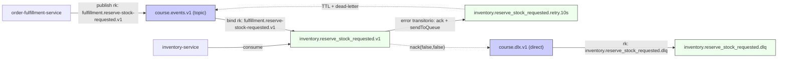

# Sesión 9 · Martes 24-feb-2026
## Repaso rápido de la Sesión 8

- Principios de EDA: eventos como fuente de verdad, brokers/streams, etc.
- RabbitMQ: exchanges, bindings, colas, DLX/DLQ, poison messages, etc.
- Kafka: topic, partition, consumer group, etc.
- Errores y retries: requeue, retry con delay, poison queue, etc.
- Event versioning: tolerant reader, up-casters, streams paralelos.
- Buenas prácticas: evitar service chaining, uso de gateway/BFF y consideraciones básicas de seguridad.

---

## Punto de partida: el proyecto final (`project/`)

En `project/` ya tienes un flujo EDA mínimo basado en **Outbox/Inbox** y un broker (**RabbitMQ**) para desacoplar bounded contexts:

- `order-fulfillment-service` publica comandos de integración (`ReserveStockRequested`, `ReleaseReservationRequested`).
- `inventory-service` consume comandos, aplica reglas y publica resultados (`StockReserved` / `StockReservationRejected`).
- `order-fulfillment-service` consume resultados y actualiza el estado (read model) del pedido.

### Topología RabbitMQ (nombres reales del proyecto)

- Exchange (topic): `course.events.v1`
- DLX (direct): `course.dlx.v1`
- Queues principales:
  - `inventory.reserve_stock_requested.v1`
  - `inventory.release_reservation_requested.v1`
  - `fulfillment.inventory_results.v1`
- Retry queues (TTL 10s):
  - `inventory.reserve_stock_requested.retry.10s`
  - `inventory.release_reservation_requested.retry.10s`
  - `fulfillment.inventory_results.stock_reserved.retry.10s`
  - `fulfillment.inventory_results.stock_rejected.retry.10s`
- DLQs:
  - `inventory.reserve_stock_requested.dlq`
  - `inventory.release_reservation_requested.dlq`
  - `fulfillment.inventory_results.dlq`


```mermaid
flowchart LR
  X["course.events.v1 (topic)"]:::broker
  DLX["course.dlx.v1 (direct)"]:::broker

  Q1["inventory.reserve_stock_requested.v1"]:::queue
  R1["inventory.reserve_stock_requested.retry.10s"]:::queue
  D1["inventory.reserve_stock_requested.dlq"]:::queue

  F["order-fulfillment-service"] -->|publish rk: fulfillment.reserve-stock-requested.v1| X
  X -->|bind rk: fulfillment.reserve-stock-requested.v1| Q1
  I["inventory-service"] -->|consume| Q1

  Q1 -. nack(false,false) .-> DLX
  DLX -->|rk: inventory.reserve_stock_requested.dlq| D1

  Q1 -->|error transitorio: ack + sendToQueue| R1
  R1 -. TTL + dead-letter .-> X

classDef broker fill:#ccf,stroke:#333,stroke-width:1px;
classDef queue fill:#efe,stroke:#333,stroke-width:1px;
```

### Cómo lo levantamos hoy (para trabajar con métricas/logs/trazas)

Desde la raíz del repo:

```bash
docker compose -f project/docker-compose.yml up -d --build
```

Para generar tráfico automático (útil para ver telemetría sin hacer cURL manual):

```bash
docker compose -f project/docker-compose.yml --profile demo up -d --build
```

Puntos de verificación rápidos:

- RabbitMQ: `http://localhost:15672` (`guest`/`guest`)
- Grafana: `http://localhost:3001` (anonymous `Admin`)
- Prometheus targets: `http://localhost:9090/targets`

---

## Qué haremos en la Sesión 9 (usando el proyecto como laboratorio)

- **Resiliencia en consumidores:** distinguir fallos transitorios vs permanentes, y aplicar `retry con delay` + `DLQ` sin perder mensajes.
- **Idempotencia:** deduplicación con Inbox (evitar efectos duplicados en redeliveries).
- **Troubleshooting:** mirar colas, DLQs, retries y tiempos de procesamiento para explicar “qué pasó”.
- **Observabilidad:** ver métricas (Prometheus), logs (Loki) y trazas (Tempo) para seguir un flujo end-to-end.

