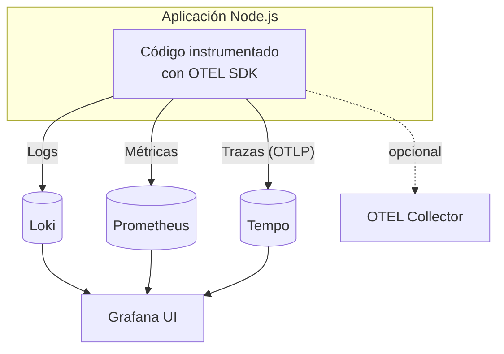
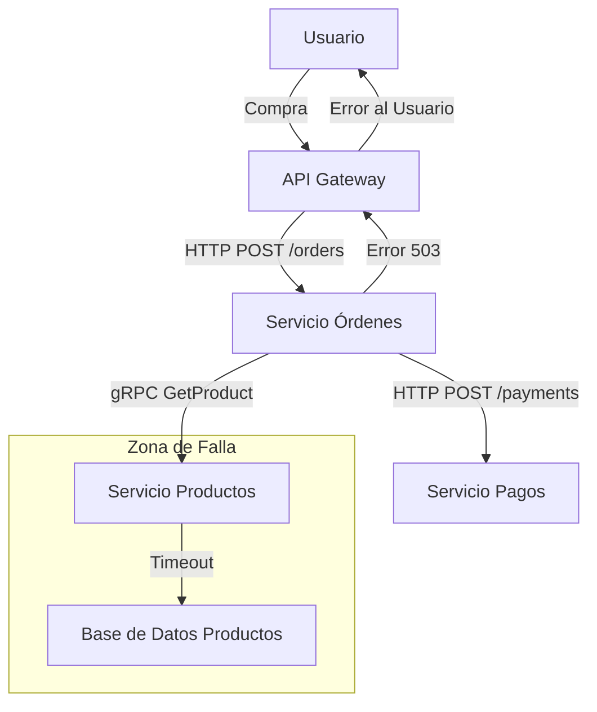
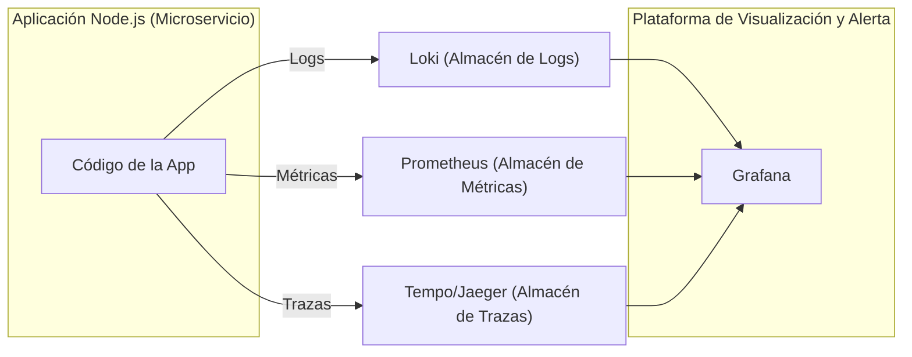
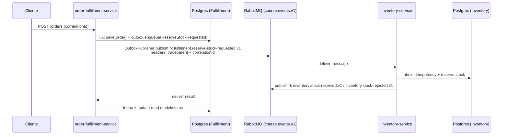
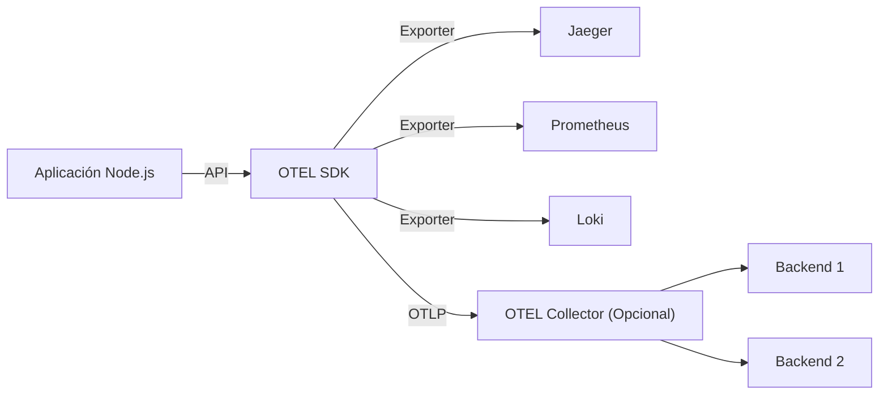
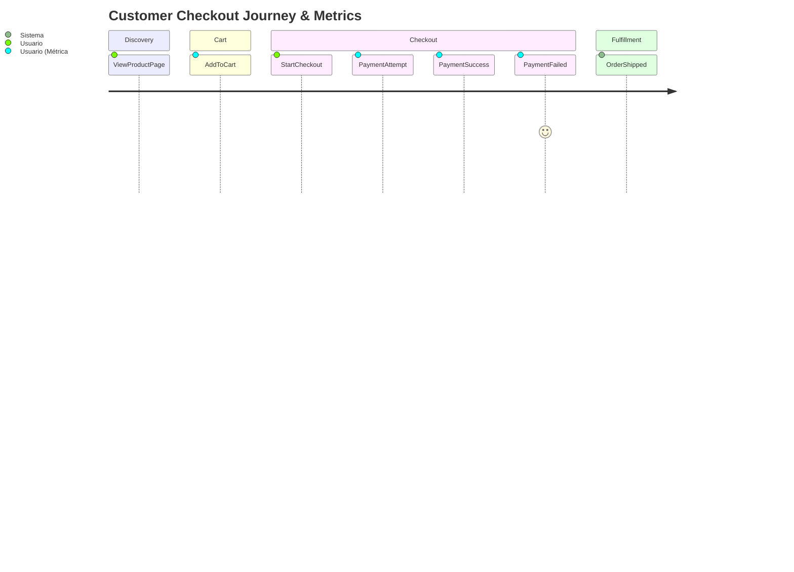

# Clase: Observabilidad en Node.js y Microservicios

Mapa rápido del tool‑chain (¿qué es cada cosa y para qué sirve?)

| Herramienta                     | Rol en el stack                                                                                                           | ¿Por qué la elegimos en 2026?                                                                            |
| ------------------------------- | ------------------------------------------------------------------------------------------------------------------------- | -------------------------------------------------------------------------------------------------------- |
| **Prometheus**                  | Base de datos de series temporales (TSDB). *Scrapea* métricas vía HTTP y da un potente lenguaje de consulta (**PromQL**). | Estándar CNCF, pull‑based → menos *overhead*, enorme ecosistema de *exporters* y *rules* reutilizables.  |
| **Grafana**                     | UI unificada: dashboards, alertas, exploración de métricas/logs/trazas.                                                   | Abstrae múltiples *back‑ends*; paneles listos, alertas visuales y enlaces cruzados.                      |
| **Loki**                        | Almacén de logs indexados por etiquetas en vez de por texto completo.                                                     | Consumir logs baratos (S3, local), mismo modelo de etiquetas que Prometheus ⇒ consultas coherentes.      |
| **Tempo**                       | Almacén de trazas distribuido y altamente escalable (sucesor de Jaeger/Zipkin).                                           | Soporta OTLP nativo, sin necesidad de índices costosos; se integra directo en Grafana.                   |
| **OpenTelemetry (OTEL)**        | Estándar vendor‑neutral para instrumentar aplicaciones (API + SDK + *spec*).                                              | "Instrumenta una vez, exporta a cualquiera"; comunidad activa, versión 1.0 estable.                      |
| **Promtail**                    | Agente *daemon* que lee ficheros de log y los envía a Loki con etiquetas.                                                 | Config YAML sencilla, sin *sidecar* pesado (a diferencia de Logstash o Fluend).                          |
| **OTEL Collector** *(opcional)* | Proxy/roteador que recibe telemetría, transforma y re‑exporta a uno o varios *back‑ends*.                                 | Desacopla tu app de la infraestructura de observabilidad; centraliza *sampling*, *batching* y seguridad. |
| **Docker Compose**              | Orquestador local para levantar todo el stack rápidamente.                                                                | Nada de instalar cada pieza a mano; reproducible por los alumnos en cualquier OS.                        |

> Nota (importante): en este repo **ya existe un stack completo** (Postgres + RabbitMQ + Prometheus + Grafana + Loki + Tempo + Promtail) en `project/docker-compose.yml`.  
> `curso/dia-10/ejercicios/` **no existe** (si lo ves mencionado, es material antiguo).

## 0.0 Arranque “one command” (el del proyecto)

Desde la raíz del repo:

```bash
docker compose -f project/docker-compose.yml up -d --build
```

Opcional (genera tráfico continuo para ver señales sin hacer cURL manual):

```bash
docker compose -f project/docker-compose.yml --profile demo up -d --build
```

URLs del stack (copy/paste):

- Grafana: `http://localhost:3001`
- Prometheus: `http://localhost:9090` (Targets: `http://localhost:9090/targets`)
- Loki: `http://localhost:3100`
- Tempo: `http://localhost:3200`
- RabbitMQ UI: `http://localhost:15672` (`guest` / `guest`)

Rutas del proyecto (por el API Gateway):

- API Gateway: `http://localhost:8080`
  - `GET /health`
  - `POST /orders`
  - `GET /orders/:orderId/status`
  - `GET /inventory/:sku`

### 0.1 Cómo se relacionan entre sí



* Prometheus *tira* de las métricas cada N segundos; Loki y Tempo **reciben** push desde los agentes/SDK.
* Grafana no almacena datos; sólo los visualiza y correlaciona.

### 0.2 Uso de herramientas de monitorización y registro de logs

- **Logs**: Loki/Promtail o stdout de contenedores con etiquetas útiles (`service_name`, `trace_id`).
- **Métricas**: Prometheus (scrape) + Grafana (dashboards/alertas).
- **Trazas**: OTEL + Tempo/Jaeger para encontrar el *critical path* y dependencias lentas.


**Objetivo General:** Al finalizar esta clase queremos comprender los conceptos fundamentales de la observabilidad, cómo instrumentar aplicaciones Node.js con OpenTelemetry y utilizar herramientas como Grafana, Loki y Prometheus para monitorear, depurar y analizar el comportamiento de microservicios.

## Parte 1: Fundamentos de la Observabilidad

### 1. Introducción a la Observabilidad

**¿Qué es la Observabilidad y por qué es crucial?**

- Diferencias clave entre **Monitoreo Clásico vs. Observabilidad Moderna**.
  - Monitoreo: Sabemos qué preguntas hacer (¿Está el servidor arriba?).
  - Observabilidad: Capacidad de hacer preguntas nuevas y desconocidas sobre el sistema sin necesidad de redeployar código (¿Por qué este usuario específico experimenta latencia solo en este endpoint?).
  - Desafíos en arquitecturas de microservicios: Complejidad, debugging distribuido, fallos en cascada, "unknown unknowns".
  - Beneficios: Reducción del MTTR (Mean Time To Resolution), mejora de la fiabilidad, comprensión proactiva del sistema.
- Caso real de estudio: El E-commerce en Black Friday.
  - Escenario: Picos de tráfico, errores intermitentes en el checkout, quejas de usuarios.
  - Pregunta: ¿Cómo correlacionamos un aumento en `http_server_requests_total{status_code="500"}` con las trazas específicas que fallaron y los logs detallados del error para identificar que un servicio de inventario aguas abajo estaba fallando por timeouts?



Explicación: Un timeout en la BD de Productos causa que el Servicio de Productos falle, lo que a su vez hace que el Servicio de Órdenes falle, impactando al usuario. Sin observabilidad, encontrar la causa raíz (D) es un desafío.

- Discusión Rápida:
  - ¿Habeis enfrentado problemas similares y cómo los resolvieron?
  - ¿Qué herramientas usan actualmente para monitorear sus aplicaciones?

### 2. Los Pilares de la Observabilidad: Logs, Métricas y Trazas

Introducción a los 3 Pilares: La base para entender el comportamiento del sistema.

**Logs (Registros):**

- ¿Qué son? Eventos discretos, inmutables y con marca de tiempo. Útiles para información detallada y errores específicos.
- Buenas prácticas: Logs estructurados (JSON), niveles de log (INFO, WARN, ERROR), incluir contexto relevante (IDs de correlación, IDs de usuario).
- Herramientas Comunes: Loki, ELK Stack (Elasticsearch, Logstash, Kibana).

**Métricas:**

- ¿Qué son? Agregaciones numéricas medibles en el tiempo (contadores, medidores, histogramas). Útiles para dashboards, alertas y entender tendencias.
- Tipos comunes: Tasa de errores, latencia (percentiles P95, P99), throughput (RPS), uso de CPU/memoria.
- Herramientas Comunes: Prometheus, DataDog, Dynatrace.

**Trazas (Tracing Distribuido):**

- ¿Qué son? Representan el flujo de una solicitud a través de múltiples servicios. Compuestas por "spans" (unidades de trabajo).
- Beneficios: Identificar cuellos de botella, entender dependencias entre servicios, depurar errores en sistemas distribuidos.
- Conceptos Clave: `traceId`, `spanId
- Herramientas Comunes: Jaeger, Tempo (parte de Grafana Stack), Zipkin, DataDog APM, Dynatrace.
- Correlación entre Pilares: La magia ocurre cuando se usan juntos. Ejemplo: Una alerta de **métrica** (alta latencia P99) te lleva a una **traza** específica, donde un span anómalo te permite ver los **logs** de ese servicio y span particular para encontrar el error.



_Explicación:_ La aplicación emite los tres tipos de señales, que son recolectadas por sus respectivos backends y luego visualizadas y correlacionadas en Grafana.

---

## Aplicado al proyecto del curso: observabilidad en flujos EDA (Outbox + RabbitMQ)

En un sistema orientado a eventos, “ver” el sistema significa poder responder:

- ¿Qué **comando** originó este evento? (`correlationId`)
- ¿Cuánto tardó el flujo end‑to‑end? (**trace**)
- ¿En qué cola se quedó atascado? (**métricas**)
- ¿Por qué terminó en DLQ? (**logs + headers `x-death`**)

**Definiciones útiles:**

- **`correlationId`:** id funcional del flujo (pedido/reserva). Lo defines tú y viaja entre servicios.
- **`traceId`:** id técnico de una traza distribuida (OTel). Normalmente viaja como `traceparent`.
- **Baggage:** pares clave/valor que viajan con el contexto de tracing (útil con cuidado).

Diagrama mínimo (lo que buscamos ver en Tempo/Grafana):



En la práctica, la instrumentación suele ser:

- **Automática** para HTTP/DB, y
- **manual** (o con instrumentación específica) en publish/consume AMQP para enriquecer spans con `routingKey`, `queue`, `messageId`.

### Ejercicio práctico (proyecto real): ver logs + métricas + trazas “en 5 minutos”

Objetivo: que un alumno pueda decir “qué pasó” con un flujo usando sólo Grafana.

1) Genera un request con `x-correlation-id`:

```bash
curl -i -X POST http://localhost:8080/orders \
  -H "content-type: application/json" \
  -H "x-correlation-id: RES-ORDER-000001" \
  -d '{
    "orderId":"ORDER-000001",
    "reservationId":"RES-ORDER-000001",
    "lines":[{"lineId":"LINE-0001","sku":"11111111-1111-1111-1111-111111111111","qty":1}]
  }'
```

2) Dashboards (Grafana → Dashboards):

- `HTTP Metrics (Course)` → RPS/latencia por `service` y `route`
- `Service Health (Course)` → colas, DLQ/retries y métricas EDA (`eda_*`)

3) Logs (Grafana → Explore → datasource **Loki**):

- `{service="api-gateway"}`
- `{service="order-fulfillment-service"}`
- `{service="inventory-service"}`

Y para ver un flujo por correlación:

- `{service="api-gateway"} |= "RES-ORDER-000001"`

4) Métricas “raw” (Prometheus):

- Targets: `http://localhost:9090/targets` (todo `UP`)
- Ejemplo RPS por servicio:

```promql
sum by (service) (rate(http_server_requests_total[1m]))
```

5) Trazas (Grafana → Explore → datasource **Tempo**):

- Filtra por servicio (`api-gateway`, `order-fulfillment-service`, `inventory-service`) y rango temporal “últimos 5–10 min”.

Dónde vive la configuración del stack en el repo:

- `project/observability/prometheus.yml`
- `project/observability/promtail-config.yml`
- `project/observability/tempo-config.yml`
- `project/observability/grafana/dashboards/*`

---

### 3. OpenTelemetry: El Estándar de la Trazabilidad Moderna

**¿Qué es OpenTelemetry (OTEL)?**

- Un conjunto de APIs, SDKs, herramientas y especificaciones **agnósticas al proveedor**.
- Objetivo: Estandarizar la forma en que se recolecta y exporta la telemetría (logs, métricas, trazas).
- Incubado por la CNCF (Cloud Native Computing Foundation).

**Componentes Clave de OTEL:**

- **API (Application Programming Interface):** Define cómo instrumentar el código (crear spans, registrar métricas). Tu código interactúa con la API.
- **SDK (Software Development Kit):** Implementación concreta de la API. Gestiona el muestreo (sampling), procesamiento y exportación de datos.
- **Exporters:** Envían datos a diferentes backends (Jaeger, Prometheus, Loki, OTLP Collector, DataDog, etc.).
- **Collector (Opcional pero recomendado):** Un proxy que recibe telemetría, la procesa/filtra y la reenvía a uno o más backends. Desacopla la app del backend.



**Instrumentación en Node.js:**

- **Automática:** Librerías que "parchean" módulos comunes (HTTP, Express, gRPC, clientes de BD) para generar spans y métricas automáticamente.
  - Ej: `@opentelemetry/auto-instrumentations-node`
- **Manual:** Crear spans y métricas explícitamente en tu código para lógica de negocio específica.
- **Demo en vivo (conceptual):** Mostrar una traza compleja en Jaeger o Tempo, explicando la jerarquía de spans, tags, logs en spans, y cómo ayuda a identificar cuellos de botella.

**Ejercicio práctico (en este repo): localizar una traza real del proyecto**

En lugar de un “ejercicio aislado”, usamos el proyecto real (porque ya está instrumentado).

1) Levanta el stack (sección 0.0) y genera una orden (sección “Ejercicio práctico” arriba).

2) En Grafana (`http://localhost:3001`) → **Explore**:

- **Tempo**: filtra por `service.name` (`api-gateway` / `order-fulfillment-service` / `inventory-service`) y abre una traza reciente.
- **Loki**: busca el mismo `x-correlation-id` (se usa como `reqId`).

3) Localiza el código de instrumentación:

- `project/*/src/infra/observability/otel.ts` (SDK + OTLP exporter + Prometheus exporter)
- `project/*/src/infra/observability/httpMetrics.ts` (métricas HTTP)
- `project/*/src/infra/observability/messagingMetrics.ts` (métricas EDA: consumers/outbox)

---

## Aplicado al proyecto del curso: bootstrap OTEL por servicio

Objetivo: que **cada servicio** exponga:

- trazas OTLP a Tempo (`OTEL_EXPORTER_OTLP_ENDPOINT=http://localhost:4318`)
- métricas Prometheus en un puerto distinto (para evitar colisión al correr 2 servicios)

Boilerplate recomendado:

1) Crear `otel.ts` por servicio:

- `project/order-fulfillment-service/src/infra/observability/otel.ts`
- `project/inventory-service/src/infra/observability/otel.ts`

```ts
import { NodeSDK } from "@opentelemetry/sdk-node";
import { OTLPTraceExporter } from "@opentelemetry/exporter-trace-otlp-http";
import { getNodeAutoInstrumentations } from "@opentelemetry/auto-instrumentations-node";
import { resourceFromAttributes } from "@opentelemetry/resources";
import { SemanticResourceAttributes } from "@opentelemetry/semantic-conventions";
import { PrometheusExporter } from "@opentelemetry/exporter-prometheus";

export async function startOtel(serviceName: string) {
  const otlpBase =
    process.env.OTEL_EXPORTER_OTLP_ENDPOINT ?? "http://localhost:4318";

  const metricsPort = Number(process.env.METRICS_PORT) || 9464;
  const prometheusExporter = new PrometheusExporter({
    port: metricsPort,
    endpoint: "/metrics",
  });

  const traceExporter = new OTLPTraceExporter({ url: `${otlpBase}/v1/traces` });

  const sdk = new NodeSDK({
    resource: resourceFromAttributes({
      [SemanticResourceAttributes.SERVICE_NAME]: serviceName,
    }),
    traceExporter,
    metricReader: prometheusExporter,
    instrumentations: [getNodeAutoInstrumentations()],
  });

  await sdk.start();
  return sdk;
}
```

2) Inicializar OTEL al principio de `main.ts` (antes de crear Fastify y antes de usar adaptadores):

- `project/inventory-service/main.ts`
- `project/order-fulfillment-service/main.ts`

```ts
import { startOtel } from "./src/infra/observability/otel";

async function start() {
  await startOtel("inventory-service");
  // ... resto del bootstrap del servicio
}
```

> Si ves que falta instrumentación de RabbitMQ, puedes añadir instrumentación específica o crear spans manuales en tus adaptadores AMQP (publish/consume).

## Parte 2: Implementación Práctica y Casos de Uso

### 4. Monitoreo y control de métricas en entornos de microservicios

**Más allá de las Métricas de Infraestructura:** No solo CPU/Memoria. Necesitamos métricas que reflejen la salud de la aplicación y el impacto en el negocio.

**Métricas GOLD (Google SRE):** Latency, Errors, Traffic, Saturation. Aplicables a servicios.

**Métricas de Negocio (KPIs):**

- Derivadas de eventos del dominio: `UserSignedUp`, `OrderCreated`, `PaymentProcessed`, `PaymentFailed`.
- Ejemplos: Tasa de conversión (ej. `PaymentSuccess / PaymentAttempt`), número de carritos abandonados, valor promedio de orden (AOV).
- ¿Cómo instrumentarlas? Contadores, Gauges.

**Diagrama Mermaid: Customer Journey y Métricas Relevantes**



_Explicación:_ Cada paso del journey puede generar métricas que ayudan a entender el embudo y los puntos de fricción.

**Ejercicio Práctico: Instrumentar Métricas Custom y Crear Dashboard (20m):**

En este repo no necesitamos “montar otro Prometheus”: el stack del proyecto **ya scrapea** las métricas OTEL de los 3 servicios.

Objetivo del ejercicio: añadir **1 KPI** simple (un contador) y verlo en Grafana.

1) Crea un contador de negocio:

- Archivo: `project/order-fulfillment-service/src/infra/observability/businessMetrics.ts`
- Métrica: `orders_placed_total` con labels `{service, outcome}`

2) Incrementa el contador cuando se acepta el `POST /orders`:

- Archivo: `project/order-fulfillment-service/src/infra/http/orderRouter.ts`

3) Rebuild:

```bash
docker compose -f project/docker-compose.yml up -d --build
```

4) Genera tráfico:

```bash
curl -i -X POST http://localhost:8080/orders \
  -H "content-type: application/json" \
  -H "x-correlation-id: RES-ORDER-000002" \
  -d '{
    "orderId":"ORDER-000002",
    "reservationId":"RES-ORDER-000002",
    "lines":[{"lineId":"LINE-0002","sku":"11111111-1111-1111-1111-111111111111","qty":1}]
  }'
```

5) Verifica en Prometheus (`http://localhost:9090`) con:

```promql
sum by (service, outcome) (rate(orders_placed_total[1m]))
```

6) Grafana (`http://localhost:3001`) → **Explore (Prometheus)** o crea un panel con esa query.

---

### 5. Detección y prevención de fallas en microservicios (alertas y notificaciones)

#### 5.1 Optimización y mejora continua en entornos de microservicios

- Define SLOs (latencia, error rate) y usa *error budgets* para priorizar trabajo de fiabilidad.
- Revisa incidentes (postmortems) y convierte hallazgos en automatización: alertas mejores, dashboards y runbooks.

**¿Por qué Alertas?** Notificación proactiva de problemas antes de que los usuarios los reporten (o a gran escala).

**Tipos de Alertas:**

- **Basadas en Métricas:** Umbrales (CPU \> 80%), tasas de error (errores 5xx \> 5%), anomalías. (Prometheus + Alertmanager).
- **Basadas en Logs:** Patrones de error específicos en logs (Loki puede generar alertas o Grafana sobre Loki).
- **Basadas en Trazas (Menos común para alertas directas):** Más para investigación, pero se pueden derivar métricas de trazas (ej. % de trazas con error).

**Buenas Prácticas para Alertas:**

- **Accionables:** Cada alerta debe llevar a una acción o investigación clara.
- **Evitar Fatiga por Alertas ("Alert Fatigue"):** No alertar por todo. Agrupar, usar severidades, definir bien los umbrales y duraciones (`for:` en Prometheus).
- **Documentación (Runbooks):** ¿Qué hacer cuando salta esta alerta?
- **Canales de Notificación:** Slack, PagerDuty, email, etc.

**Ejercicio Práctico: Configurar Alerta en Prometheus y Notificación:**

1.  Configurar Alertmanager (si no está en `docker-compose.yml`):

```yaml
# docker-compose.yml
# ...
alertmanager:
  image: prom/alertmanager:v0.25.0
  ports:
    - "9093:9093"
  volumes:
    - ./alertmanager.yml:/etc/alertmanager/alertmanager.yml
  command: --config.file=/etc/alertmanager/alertmanager.yml
```

_Y un `alertmanager.yml` básico (para Slack, necesitarás un webhook URL real):_

```yaml
# alertmanager.yml
global:
  resolve_timeout: 5m
  slack_api_url: "<TU_SLACK_WEBHOOK_URL>" # ¡Reemplazar!

route:
  group_by: ["alertname", "job"]
  group_wait: 30s
  group_interval: 5m
  repeat_interval: 1h
  receiver: "slack-notifications"
receivers:
  - name: "slack-notifications"
    slack_configs:
      - channel: "#tu-canal-de-alertas" # ¡Reemplazar!
        send_resolved: true
        title: '[{{ .Status | toUpper }}{{ if eq .Status "firing" }}:{{ .Alerts.Firing | len }}{{ end }}] {{ .CommonLabels.alertname }} for {{ .CommonLabels.job }}'
        text: >-
          {{ range .Alerts }}
            *Alert:* {{ .Annotations.summary }} - `{{ .Labels.alertname }}`
            *Description:* {{ .Annotations.description }}
            *Details:*
            {{ range .Labels.SortedPairs }} • *{{ .Name }}:* `{{ .Value }}`
            {{ end }}
          {{ end }}
```

1.  Indicar a Prometheus dónde está Alertmanager (`prometheus.yml`):

```yaml
# prometheus.yml
# ...
alerting:
  alertmanagers:
    - static_configs:
        - targets: ["alertmanager:9093"] # Si está en la misma red Docker

rule_files:
  - "alert.rules.yml" # Archivo donde definiremos las alertas
```

3.  Crear archivo `alert.rules.yml`:

```yaml
# alert.rules.yml
groups:
  - name: NodeAppAlerts
    rules:
      - alert: HighErrorRateMyNodeApp
        expr: sum(rate(http_server_requests_total{status_code=~"5.."}[1m])) / sum(rate(http_server_requests_total[1m])) > 0.1
        for: 1m # Duración para que la condición sea verdadera antes de disparar
        labels:
              severity: critical
            annotations:
              summary: "Alta tasa de errores HTTP ({{ $labels.job }})"
              description: "El servicio {{ $labels.job }} está experimentando más del 10% de errores 5xx en el último minuto. Valor actual: {{ $value | humanizePercentage }}."
          # Alerta de ejemplo para la métrica custom de "orders.total"
          - alert: TooFewOrders
            expr: sum(increase(orders_total{job="my-node-app"}[5m])) < 1
            for: 5m
            labels:
              severity: warning
            annotations:
              summary: "Pocas órdenes procesadas ({{ $labels.job }})"
              description: "El servicio {{ $labels.job }} ha procesado menos de 1 orden en los últimos 5 minutos."
```

_(Nota: en el `project/` del curso exportamos `http_server_requests_total` y `http_server_request_duration_ms_*` con labels `service`, `route`, `method`, `status_code`. Asegúrate que tus queries usen esos nombres/labels)._

1.  Reiniciar `docker-compose` (Prometheus y Alertmanager).

2.  Simular Errores para Disparar la Alerta:

- Opción A (infra): parar RabbitMQ para provocar fallos reales al publicar (debería impactar en `/replenish`).
- Opción B (app): crear un endpoint `/error` temporal que devuelva 500.

Ejemplo de llamada:

```bash
curl -i -X POST "http://localhost:3002/replenish" \
  -H "Content-Type: application/json" \
  -d '{"sku":"ABC-1234-AB","quantity":10}'
```

3.  Verificar Alertas:

- En Prometheus UI (`http://localhost:9090/alerts`). Debería pasar de PENDING a FIRING.
- En Alertmanager UI (`http://localhost:9093`).
- En tu canal de Slack (si lo configuraste).

---

### 6. Análisis y solución de problemas en microservicios (debugging distribuido)

#### 6.1 Identificación y resolución de cuellos de botella y cuellos de rendimiento

Usa trazas para identificar el *critical path* y métricas para validar saturación (CPU/memoria/DB/colas). Si el cuello es externo, aplica límites: timeouts, circuit breakers, caché o degradación controlada.

**Escenario del Problema (Guiado por el instructor):**

- "Los usuarios reportan que el endpoint `/api/v1/user/:id/profile` está extremadamente lento a veces, e incluso da timeouts."
  - Este endpoint en el `ServicioA` (Node.js) internamente llama a:
    - `ServicioB` (Node.js) para obtener datos básicos del usuario (`/users/:id`).
    - `ServicioC` (Node.js) para obtener el historial de compras (`/users/:id/orders`).
    - `ServicioD` (externo, legacy) para obtener preferencias de marketing (`/marketing/:email/prefs`).
      - Todos los servicios están instrumentados con OpenTelemetry y envían trazas a Tempo, métricas a Prometheus y logs a Loki.

**Pasos para los Alumnos (trabajando juntos o individualmente):**

1.  Identificar la Métrica Afectada (Grafana/Prometheus):

- ¿Qué métrica buscarían? (Ej: `http_server_request_duration_ms_bucket{route=\"/api/v1/user/:id/profile\", service=\"servicio-a\"}`).
- Visualizar P95 o P99 de latencia. Confirmar el problema.
- Buscar correlación con tasas de error si las hay.

2.  Encontrar Trazas Relevantes (Grafana/Tempo):

- Desde el dashboard de métricas, ¿cómo pivotarían a trazas? (Idealmente, un dashboard que linkee traceIDs o permita filtrar por tiempo y servicio).
- Si no hay link directo, usar el explorador de Tempo. Buscar trazas para `service_name="servicio-a"` con `http.target="/api/v1/user/:id/profile"` que sean lentas (ordenar por duración) o tengan errores.

3.  Analizar la Traza (Grafana/Tempo):

- Identificar el "critical path" de la traza.
- ¿Qué `span` está tomando más tiempo? ¿Es en `ServicioA`, `B`, `C` o `D`?
- ¿Hay errores marcados en algún span? ¿Atributos (`tags`) útiles?
- _Suposición para el ejercicio:_ El `span` de la llamada a `ServicioD` (externo) es el que muestra una latencia muy alta y variable.

4.  Correlacionar con Logs (Grafana/Loki):

- De la traza/span problemático, obtener el `trace_id` (y `span_id` si es útil).
- Ir a Loki en Grafana y buscar logs con ese `trace_id`: `{service_name="servicio-a", trace_id="<valor_del_trace_id>"}`.
- ¿Qué dicen los logs del `ServicioA` justo antes y después de llamar a `ServicioD`? (Ej: "INFO: Calling Marketing Service D", "WARN: Marketing Service D call took 3500ms").
- ¿Hay logs de timeout o de reintentos?

5.  Crear un Dashboard Ad-Hoc (Opcional, si hay tiempo):

- Un dashboard rápido en Grafana que muestre:
  - Latencia P99 del endpoint `/api/v1/user/:id/profile`.
  - Latencia P99 de la llamada externa a `ServicioD` (si se tiene una métrica específica para ello, ej. `http_client_requests_seconds_bucket{peer_service="servicio-d"}`).
  - Logs filtrados por `trace_id` para investigaciones rápidas.

6.  Proponer un Fix o Mitigación (Discusión):

- Basado en el hallazgo (ej. `ServicioD` es lento):
  - **Corto plazo:** Implementar un timeout más agresivo y un circuit breaker para `ServicioD`. Cachear respuestas de `ServicioD` si los datos no son ultra-críticos en tiempo real. ¿Carga condicional de datos de marketing?
  - **Largo plazo:** Hablar con el equipo de `ServicioD` para que mejoren su rendimiento o provean una API más eficiente. ¿Reemplazar `ServicioD`?

---

## Parte 3: Operación de microservicios

Esta parte conecta observabilidad con temas operativos: registro de servicios, configuración, orquestación, backup y recuperación.

### 7. Implementación de sistemas de descubrimiento y registro de servicios

- En **Compose**, el DNS interno resuelve por nombre de servicio.
- En **Kubernetes**, se usa `Service` + DNS + *labels*.
- En entornos híbridos, se usan herramientas como **Consul** (catálogo) y *health checks* activos.

Objetivo: que los servicios **no dependan de IPs** ni de configuración manual por entorno.

### 8. Gestión de configuraciones y variables de entorno en microservicios

- `12-factor`: configuración por env vars (`DATABASE_URL`, `RABBIT_URL`, `OTEL_*`).
- Separar **secrets** de config (vault/secret manager).
- Validar config en arranque (fail-fast) y exponerla en `/ready` (sin filtrar secretos).

### 9. Escalado automático y orquestación de contenedores en microservicios

- Autoescalado (HPA) por CPU/RPS/latencia (cuando hay métricas fiables).
- *Rate limiting* y *backpressure* para evitar “autodestrucción” por picos.

### 10. Estrategias de respaldo y recuperación en entornos de microservicios

- Backups de base de datos (puntos de restauración, retención).
- Para sistemas orientados a eventos: retención de mensajes/eventos según SLA y *replays* controlados cuando sea posible.
- Runbooks: procedimientos de recuperación probados (no solo documentados).
