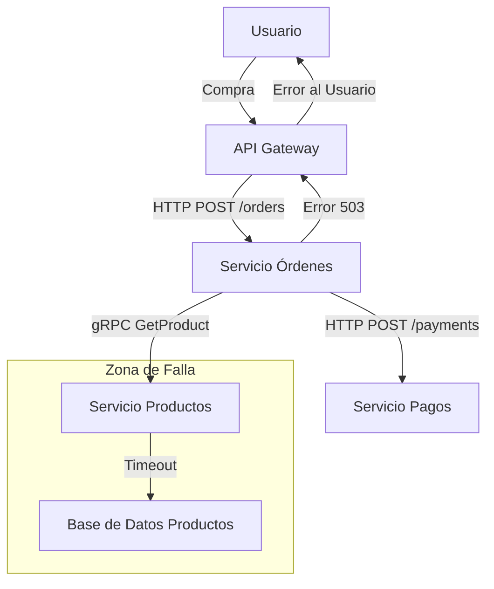
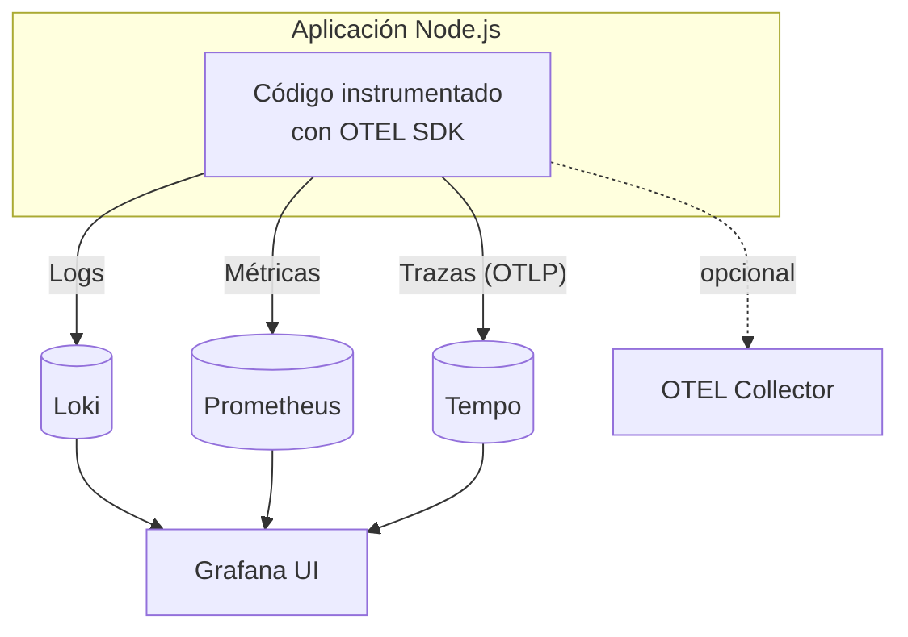

# Clase: Observabilidad en Node.js y Microservicios (Sesión de Recorrido)

## Base teórica rápida (antes del recorrido)

### Observabilidad vs monitoreo

- **Monitoreo clásico**: responde preguntas conocidas (estado UP/DOWN, CPU alta, etc.).
- **Observabilidad**: permite investigar preguntas nuevas sin cambiar el código en ese momento.
- En microservicios, la observabilidad reduce tiempo de diagnóstico (MTTR) al correlacionar señales de varios servicios.
- Ejemplo Black Friday: suben los `500` en checkout; con observabilidad correlacionas métrica de error, traza lenta y logs para ubicar rápido la causa raíz (por ejemplo, timeout en inventario) y no solo el síntoma en el gateway.

Caso Black Friday (cadena de falla):



### Los 3 pilares

- **Logs**: eventos detallados y contexto (errores, decisiones de negocio, IDs).
- **Métricas**: series numéricas agregadas para tendencias, SLOs y alertas.
- **Trazas**: camino end-to-end de una petición/evento entre servicios.

La práctica recomendada es usar los 3 juntos: una métrica detecta anomalía, una traza ubica el tramo lento/fallido y los logs explican la causa.

### Métricas: conceptos mínimos

- **Counter**: siempre crece (`*_total`), útil para volumen y errores.
- **Gauge**: sube/baja, útil para estado actual (ej. colas, conexiones).
- **Histogram**: distribución de latencias/tamaños, útil para percentiles (P95/P99).

Golden signals para empezar:

- **Latency**
- **Traffic**
- **Errors**
- **Saturation**

### OpenTelemetry (OTEL) en 60 segundos

- **API**: cómo instrumentar en código.
- **SDK**: procesamiento (sampling, batching) y exportación.
- **Exporter**: destino de telemetría (OTLP/Prometheus/etc.).
- **Collector** (opcional): capa intermedia para enrutar/transformar señales.

Identificadores clave:

- **`traceId`**: identificador técnico de la traza distribuida.
- **`correlationId`**: identificador funcional del flujo de negocio (por ejemplo `RES-ORDER-*`).

En esta sesión leeremos ambos para reconstruir cada flujo E2E.

## Mapa rápido del tool‑chain (¿qué es cada cosa y para qué sirve?)

| Herramienta                     | Rol en el stack                                                                                                           | ¿Por qué la elegimos en 2026?                                                                            |
| ------------------------------- | ------------------------------------------------------------------------------------------------------------------------- | -------------------------------------------------------------------------------------------------------- |
| **Prometheus**                  | Base de datos de series temporales (TSDB). *Scrapea* métricas vía HTTP y da un potente lenguaje de consulta (**PromQL**). | Estándar CNCF, pull‑based → menos *overhead*, enorme ecosistema de *exporters* y *rules* reutilizables.  |
| **Grafana**                     | UI unificada: dashboards, alertas, exploración de métricas/logs/trazas.                                                   | Abstrae múltiples *back‑ends*; paneles listos, alertas visuales y enlaces cruzados.                      |
| **Loki**                        | Almacén de logs indexados por etiquetas en vez de por texto completo.                                                     | Consumir logs baratos (S3, local), mismo modelo de etiquetas que Prometheus ⇒ consultas coherentes.      |
| **Tempo**                       | Almacén de trazas distribuido y altamente escalable (sucesor de Jaeger/Zipkin).                                           | Soporta OTLP nativo, sin necesidad de índices costosos; se integra directo en Grafana.                   |
| **OpenTelemetry (OTEL)**        | Estándar vendor‑neutral para instrumentar aplicaciones (API + SDK + *spec*).                                              | "Instrumenta una vez, exporta a cualquiera"; comunidad activa, versión 1.0 estable.                      |
| **Promtail**                    | Agente *daemon* que lee ficheros de log y los envía a Loki con etiquetas.                                                 | Config YAML sencilla, sin *sidecar* pesado (a diferencia de Logstash o Fluend).                          |
| **OTEL Collector** *(opcional)* | Proxy/roteador que recibe telemetría, transforma y re‑exporta a uno o varios *back‑ends*.                                 | Desacopla tu app de la infraestructura de observabilidad; centraliza *sampling*, *batching* y seguridad. |
| **Docker Compose**              | Orquestador local para levantar todo el stack rápidamente.                                                                | Nada de instalar cada pieza a mano; reproducible por los alumnos en cualquier OS.                        |




---

## Modo de trabajo de la sesión

- Estado inicial esperado: proyecto completo y contenedores levantados.
- Enfoque: navegar por evidencias existentes (código + Grafana + RabbitMQ + DB).
- Resultado esperado: poder responder “qué pasó” en un flujo E2E sin tocar la implementación.

---

## Prerrequisitos (antes de empezar la clase)

Desde la raíz del repo:

```bash
docker compose -f project/docker-compose.yml up -d --build
```

Opcional para tráfico automático:

```bash
docker compose -f project/docker-compose.yml --profile demo up -d --build
```

URLs:

- Grafana: `http://localhost:3001`
- Prometheus: `http://localhost:9090`
- Loki: `http://localhost:3100`
- Tempo: `http://localhost:3200`
- RabbitMQ UI: `http://localhost:15672` (`guest` / `guest`)
- API Gateway: `http://localhost:8080`

---

## Qué vamos a observar (sin implementar)

1. Flujo funcional E2E por `correlationId`.
2. Trazas distribuidas (HTTP + RabbitMQ + servicios).
3. Logs estructurados y búsqueda en Loki.
4. Métricas técnicas y de negocio en Prometheus/Grafana.
5. Comportamiento EDA: outbox, retries y DLQ.

---

## 1) Mapa de señales y stack

### Herramientas y rol

| Herramienta | Rol |
|---|---|
| Prometheus | Scrape de métricas (`/metrics`) y consultas PromQL |
| Grafana | Visualización unificada (métricas, logs, trazas) |
| Loki + Promtail | Recolección y consulta de logs por etiquetas |
| Tempo | Almacenamiento de trazas OTEL |
| OpenTelemetry | Instrumentación estándar (traces/metrics/context) |
| RabbitMQ | Transporte de eventos EDA |

### Dónde está la configuración en el repo

- `project/docker-compose.yml`
- `project/observability/prometheus.yml`
- `project/observability/promtail-config.yml`
- `project/observability/tempo-config.yml`
- `project/observability/grafana/dashboards/*`

---

## 2) Recorrido del flujo E2E (guion principal)

### Paso A: Disparar un caso con correlación conocida

```bash
curl -i -X POST http://localhost:8080/orders \
  -H "content-type: application/json" \
  -H "x-correlation-id: RES-ORDER-000001" \
  -d '{
    "orderId":"ORDER-000001",
    "reservationId":"RES-ORDER-000001",
    "lines":[{"lineId":"LINE-0001","sku":"11111111-1111-1111-1111-111111111111","qty":1}]
  }'
```

### Paso B: Revisar estado funcional

```bash
curl -s http://localhost:8080/orders/ORDER-000001/status
```

```bash
curl -s http://localhost:8080/inventory/11111111-1111-1111-1111-111111111111
```

### Paso C: Navegar evidencia en Grafana

- Dashboard: `HTTP Metrics (Course)`
- Dashboard: `Service Health (Course)`
- Explore Loki: `{service="api-gateway"}`
- Explore Loki: `{service="order-fulfillment-service"}`
- Explore Loki: `{service="inventory-service"}`
- Explore Loki por correlación: `|= "RES-ORDER-000001"`

### Paso D: Navegar trazas en Tempo

En Grafana Explore (Tempo):

- Filtrar por servicio (`api-gateway`, `order-fulfillment-service`, `inventory-service`).
- Buscar ventanas de 5–10 minutos.
- Revisar una traza completa del flujo del pedido.

---

## 3) Qué mirar en el código (tour guiado)

### Instrumentación OTEL por servicio

- `project/api-gateway/src/infra/observability/otel.ts`
- `project/inventory-service/src/infra/observability/otel.ts`
- `project/order-fulfillment-service/src/infra/observability/otel.ts`

Qué validar al leer:

- Exportador OTLP apuntando a Tempo.
- Exposición de métricas Prometheus.
- Auto-instrumentations activas.

### Métricas HTTP y EDA

- HTTP: `project/*/src/infra/observability/httpMetrics.ts`
- EDA: `project/*/src/infra/observability/messagingMetrics.ts`

Qué validar al leer:

- Nombres de métricas (`http_*`, `eda_*`).
- Etiquetas (`service`, `route`, `outcome`, `queue`, etc.).

### Publicación/consumo de eventos

- Outbox publisher:
  - `project/order-fulfillment-service/src/infra/events/OutboxRabbitPublisher.ts`
  - `project/inventory-service/src/infra/events/OutboxRabbitPublisher.ts`
- Consumers:
  - `project/order-fulfillment-service/src/infra/messaging/InventoryResultsRabbitConsumer.ts`
  - `project/inventory-service/src/infra/messaging/ReserveStockRequestedRabbitConsumer.ts`
  - `project/inventory-service/src/infra/messaging/ReleaseReservationRequestedRabbitConsumer.ts`

Qué validar al leer:

- ACK/NACK.
- Retry queues y DLQ.
- Log estructurado en `message_received`, `message_acked`, `message_failed`.
- Presencia de `messageId`, `correlationId`, `attempt`.

### Integración funcional (caso de negocio)

- Order placement:
  - `project/order-fulfillment-service/src/application/place-order-use-case.ts`
- Resultado de inventario:
  - `project/order-fulfillment-service/src/application/HandleInventoryIntegrationEventUseCase.ts`
- Reserva de stock:
  - `project/inventory-service/src/application/HandleReserveStockRequestedUseCase.ts`

Qué validar al leer:

- Idempotencia por inbox/outbox.
- Cómo se traduce un evento técnico a decisión de dominio.

---

## 4) Observación de colas (sin cambiar código)

### Estado rápido de colas

```bash
docker compose -f project/docker-compose.yml exec -T rabbitmq \
  rabbitmqctl list_queues name messages_ready messages_unacknowledged
```

Qué interpretar:

- `*.retry.*`: picos cortos pueden ser normales.
- `*.dlq`: crecimiento sostenido implica fallo de consumo o contrato.
- `messages_unacknowledged` alto: consumer saturado o bloqueado.

### Caso de análisis recomendado

Si hay mensajes en `fulfillment.inventory_results.dlq`, inspeccionar:

1. Payload del mensaje.
2. Headers `x-attempt` y `x-death`.
3. Log `InventoryResultsRabbitConsumer.message_failed`.
4. Traza asociada por `correlationId`.

---

## 5) Checklist de lectura para cada flujo

Usar esta lista en clase para cada `reservationId`:

1. ¿Entró la petición al gateway con el `x-correlation-id` esperado?
2. ¿Se publicó `ReserveStockRequested`?
3. ¿El consumer de inventory hizo `message_acked` o `message_failed`?
4. ¿Se publicó `StockReserved` o `StockReservationRejected`?
5. ¿Fulfillment consumió resultado y actualizó estado?
6. ¿Hubo retries?
7. ¿Terminó algo en DLQ?
8. ¿Qué muestra la traza end-to-end en Tempo?

---

## 6) PromQL mínimo para la sesión

RPS por servicio:

```promql
sum by (service) (rate(http_server_requests_total[1m]))
```

Tasa de errores 5xx:

```promql
sum by (service) (rate(http_server_requests_total{status_code=~"5.."}[1m]))
```

Mensajería EDA por outcome:

```promql
sum by (service, outcome, queue) (rate(eda_consumer_messages_total[1m]))
```

Publicación outbox:

```promql
sum by (service, outcome, routing_key) (rate(eda_outbox_published_total[1m]))
```

---

## 7) Resultado esperado al finalizar la sesión

Al terminar, cada alumno debería poder:

- Seguir un pedido por `correlationId` de punta a punta.
- Explicar con evidencia por qué un mensaje terminó (o no) en DLQ.
- Relacionar una anomalía en métricas con logs y trazas concretas.
- Identificar en qué archivo del proyecto vive cada parte de la observabilidad.

---

## 8) Qué no hacemos en esta versión

- No creamos endpoints nuevos.
- No añadimos métricas nuevas durante clase.
- No cambiamos wiring OTEL en vivo.
- No hacemos refactors de dominio.

Si algo falla, lo tratamos como **caso de observación y diagnóstico**, no como ejercicio de implementación.

---

## Apéndice: comandos de apoyo

Ver targets de Prometheus:

```bash
open http://localhost:9090/targets
```

Ver logs locales (si quieres contraste con Loki):

```bash
tail -f project/logs/api-gateway.log
```

```bash
tail -f project/logs/order-fulfillment-service.log
```

```bash
tail -f project/logs/inventory-service.log
```

Detener tráfico demo:

```bash
docker compose -f project/docker-compose.yml --profile demo stop demo-traffic
```
