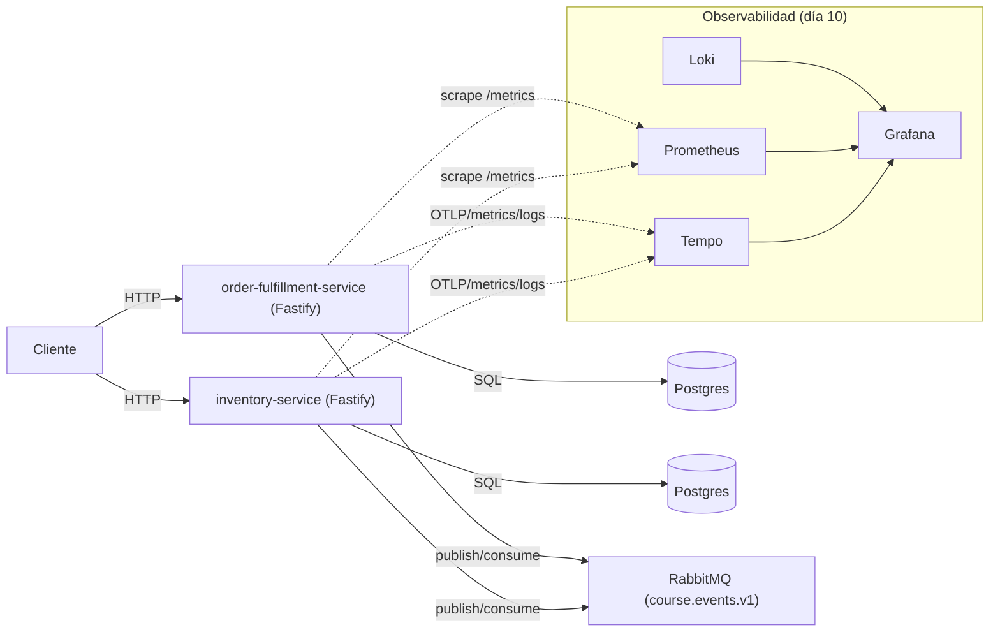

# C4 Model & Structurizr DSL

> Este material se usa en el cierre del curso como parte del bloque de estandarización, conclusiones y revisión de proyectos.

---

## Aplicado al proyecto del curso (recomendación práctica)

En `project/` ya tenemos documentación base en `project/artifacts/` (context map, contratos, reflexión). En esta sesión, la idea es **convertirlo en docs-as-code** mínimo viable:

- Mantener los artefactos que ya existen:
  - `project/artifacts/02-context-map.mmd`
  - `project/artifacts/03-integration-contracts.md`
- Añadir 1 diagrama C4 “contenedores” como fuente de verdad (opcional con Structurizr DSL):
  - `project/artifacts/05-c4.dsl` (nuevo)

### Diagrama (C4 Contenedores, en mermaid)



### Structurizr DSL (snippet mínimo)

Ejemplo (para guardar en `project/artifacts/05-c4.dsl`):

```dsl
workspace "Curso DDD Hex Node" "C4 del proyecto del curso" {
  model {
    student = person "Cliente/Estudiante" "Usa las APIs HTTP"
    system = softwareSystem "Course Project" "Order Fulfillment + Inventory" {
      fulfillment = container "order-fulfillment-service" "API + workers (Outbox/Inbox)" "Node.js + Fastify"
      inventory = container "inventory-service" "API + workers (Outbox/Inbox)" "Node.js + Fastify"
    }

    rabbit = softwareSystem "RabbitMQ" "Broker (course.events.v1)" { tags "broker" }
    postgres = softwareSystem "Postgres" "Base de datos" { tags "database" }
    grafana = softwareSystem "Grafana Stack" "Grafana + Prometheus + Loki + Tempo" { tags "observability" }

    student -> system.fulfillment "HTTP"
    student -> system.inventory "HTTP"
    system.fulfillment -> postgres "SQL"
    system.inventory -> postgres "SQL"
    system.fulfillment -> rabbit "AMQP publish/consume"
    system.inventory -> rabbit "AMQP publish/consume"
    system.fulfillment -> grafana "OTLP/metrics/logs"
    system.inventory -> grafana "OTLP/metrics/logs"
  }

  views {
    systemContext system "context" { include * autolayout lr }
    container system "containers" { include * autolayout lr }
    styles {
      element "broker" { shape Cylinder background "#DDEEFF" }
      element "database" { shape Cylinder background "#EEE" }
      element "observability" { background "#FFF4DD" }
    }
  }
}
```

Opcional (si quieres renderizarlo): usa Structurizr CLI desde local/CI. La clave del curso no es la herramienta, es que el diagrama sea **versionado** y revisable junto al código.

## Módulo 15 — Estandarización de desarrollos, conclusiones y revisión de proyectos

### 15.1 Introducción al concepto de estandarización de desarrollos

Estandarizar significa acordar convenciones y prácticas para que múltiples equipos puedan colaborar sin fricción y mantener un nivel mínimo de calidad.

### 15.2 Estrategias principales para estandarizar desarrollos entre equipos

- Guías de arquitectura (hex/DDD), convenciones de endpoints/eventos, versionado y compatibilidad.
- Definition of Done: tests, observabilidad mínima, ADRs y *runbooks*.

### 15.3 Principales herramientas

- ADRs, C4, linters/formatters, pipelines CI/CD, repos de plantillas (*service templates*).

### 15.4 Uso de métricas

- Latencia, *error rate*, throughput, lead time, change failure rate, MTTR.

### 15.5 Revisando proyectos del curso y su estandarización

Checklist de revisión: coherencia de límites, contratos, operación, seguridad, tests y telemetría mínima.

## Repaso rápido: aprendizajes clave

En las sesiones anteriores, hemos sentado una base sólida para la arquitectura de software moderna, especialmente en entornos de microservicios con Node.js.

**Temas Centrales y Progresión:**

1. **Abordar la Complejidad:**
   - Comenzamos identificando el **"Big Ball of Mud"** y cómo la complejidad creciente degrada la productividad.
   - La idea central es **separar responsabilidades**, diferenciando claramente el **Dominio** (lógica de negocio) de la **Infraestructura** (detalles técnicos como bases de datos y frameworks).

2. **Patrones Arquitectónicos como Soluciones (Sesiones 1-8):**
   - **Domain-Driven Design (DDD):**
     - **DDD Estratégico:** Enfatiza el lenguaje ubicuo, identificación de subdominios (Core, Soporte, Genérico) y definición de **Límites de Contexto**.
     - **DDD Táctico:** Modelos de dominio ricos con **Entidades**, **Value Objects**, **Aggregates**, **Eventos de Dominio**, **Repositorios**, **Servicios de Dominio** y **Factories**.
   - **Arquitectura Hexagonal (Ports and Adapters):**
     - Protege la lógica de negocio de cambios tecnológicos mediante **puertos** (interfaces) y **adaptadores** (implementaciones).
     - Uso de **Inyección de Dependencias** para acoplamiento flexible.
   - **CQRS (Segregación de Responsabilidad de Comandos y Consultas):**
     - Separa operaciones de escritura (**Comandos**) y lectura (**Consultas**).
     - Consideraciones sobre **consistencia eventual**.
   - **Arquitectura Orientada a Eventos (EDA):**
     - Comunicación asincrónica mediante **brokers de eventos** (RabbitMQ/Kafka).
     - Patrones como **Outbox Pattern** y **Sagas**.
     - Estrategias de **recuperación de errores**.

3. **Node.js y Microservicios:**
   - Ventajas del modelo **asincrónico/no bloqueante** de Node.js.
   - Herramientas recomendadas: Fastify, Prisma, OpenTelemetry, Awilix, etc.

4. **Pruebas:**
   - **Pruebas unitarias** para lógica de dominio.
   - **Pruebas de integración** para adaptadores.
   - Énfasis en velocidad y confiabilidad.

5. **Observabilidad:**
   - Tres pilares: **Logs**, **Métricas** y **Trazas**.
   - Implementación con **OpenTelemetry** y visualización en Grafana.

**Conclusión Clave:** Has aprendido a diseñar sistemas mantenibles, escalables y resilientes mediante separación de responsabilidades y comunicación orientada a eventos.


## Buenas Prácticas para Documentación de Arquitectura (Ampliado)

El Modelo C4 es un marco de trabajo para visualizar y documentar arquitecturas de software mediante cuatro niveles de abstracción progresiva: Contexto (sistema en su entorno global), Contenedores (servicios/aplicaciones principales), Componentes (módulos internos) y Código (detalles de implementación). Diseñado por Simon Brown, este enfoque permite comunicar la arquitectura a diferentes audiencias (desarrolladores, ejecutivos, operaciones) con el nivel de detalle apropiado. Por ejemplo, un diagrama de contexto muestra cómo un sistema de e-commerce interactúa con usuarios y servicios externos, mientras que un diagrama de componentes detalla cómo el módulo de pagos se integra con la pasarela externa. Su fuerza radica en la simplicidad visual y en evitar la sobrecarga de información, facilitando la alineación técnica y la toma de decisiones.

Structurizr DSL es un lenguaje específico de dominio (DSL) que permite definir modelos arquitectónicos alineados al C4 usando texto plano, compatible con herramientas como GitHub. En lugar de dibujar diagramas manualmente, describes elementos (personas, sistemas, contenedores) y sus relaciones en código, que luego se renderiza automáticamente en diagramas coherentes. Por ejemplo, puedes declarar container "OrderService" "Node.js" y sus conexiones con otros servicios, generando vistas actualizadas al modificar el código. Esta integración con flujos docs-as-code permite versionar la documentación, generar diagramas en pipelines CI/CD, y mantener una única fuente de verdad entre el código y la arquitectura, eliminando discrepancias comunes en documentación estática.

### Componentes principales

1. **Jerarquía Completa:**
   - **Personas y Sistemas Externos:** Clientes, administradores, y dependencias externas.
   - **Contenedores:** 3 microservicios + API Gateway + WebApp.
   - **Componentes Internos:** Lógica específica de cada servicio (controladores, adaptadores, repositorios).
   - **Despliegue:** Detalle de infraestructura en AWS (EC2, RDS, Redis).

2. **Vistas Múltiples:**
   - **Contexto:** Visión general del sistema y su entorno.
   - **Contenedores:** Cómo interactúan los servicios entre sí.
   - **Dinámica:** Flujo específico de procesamiento de pedidos.
   - **Despliegue:** Dónde se aloja cada componente físicamente.

3. **Estilos Visuales:**
   - Colores y formas para diferenciar tipos de elementos (externos vs internos).
   - Líneas punteadas para conexiones a sistemas externos.

4. **Integración con ADRs:**
   - Referencia explícita a decisiones arquitectónicas (Ej: uso de RabbitMQ).


### Ejemplos:
- [Ejemplo 1](https://structurizr.com/share/36141/diagrams#SystemContext)
- [Ejemplo 2](https://docs.structurizr.com/dsl/adrs)

---

## Buenas Prácticas

### **1. Documentación Viva con Automatización**
- **Pipeline CI/CD Ejemplo:**
  ```yaml
  # .github/workflows/docs.yml
  name: Generate Architecture Docs
  on: [push]
  jobs:
    generate-diagrams:
      runs-on: ubuntu-latest
      steps:
        - uses: actions/checkout@v4
        - name: Setup Structurizr CLI
          run: npm install -g @structurizr/cli
        - name: Generate Diagrams
          run: structurizr-cli export -w workspace.dsl -f plantuml
        - name: Upload Artifacts
          uses: actions/upload-artifact@v3
          with:
            name: architecture-diagrams
            path: ./out
  ```

### **2. ADR (Architecture Decision Record) Ejemplar**
```markdown
# ADR-003: Uso de RabbitMQ para Eventos

## Contexto
Necesitamos un broker de eventos para comunicación asíncrona entre servicios.

## Opciones Evaluadas
1. **Apache Kafka:** Alto rendimiento, persistencia, pero complejidad operativa.
2. **RabbitMQ:** Protocolo AMQP, colas tradicionales, más sencillo para nuestro equipo.

## Decisión
**RabbitMQ** por:
- Madurez y amplia documentación.
- Soporte nativo para patrones como DLQ/Exchanges.
- Equipo ya tiene experiencia operativa con él.

## Consecuencias
- Deberemos implementar el *Outbox Pattern* para garantizar entrega.
- Planificar escalado horizontal con clusters si el volumen crece.
```
