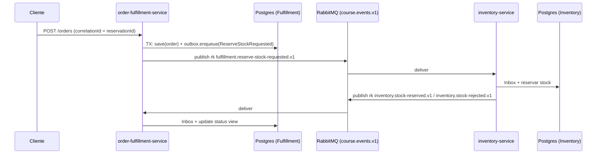
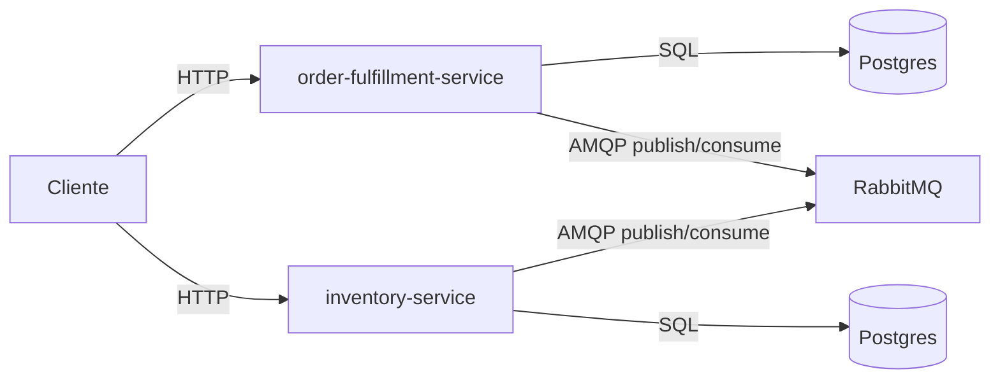

# Proyecto final evolutivo

Objetivo: dejar el proyecto (`project/`) **operable**: servicios levantan, flujos EDA funcionan (Outbox/Inbox + RabbitMQ) y tenemos observabilidad mínima (logs/métricas/trazas).

## Arranque del proyecto (lo que debe funcionar “sin pensar”)

Desde la raíz del repo:

```bash
docker compose -f project/docker-compose.yml up -d --build
```

Opcional (tráfico automático para que haya señales en dashboards):

```bash
docker compose -f project/docker-compose.yml --profile demo up -d --build
```

Qué abrir (copy/paste):

- API Gateway: `http://localhost:8080/health`
- Grafana: `http://localhost:3001`
- Prometheus targets: `http://localhost:9090/targets`
- RabbitMQ UI: `http://localhost:15672` (`guest` / `guest`)

## Desarrollando la solución

1. Asegurar esquema Postgres (sin Prisma)
   - Ambos servicios inicializan tablas con `initSchema()` al arrancar (repos Postgres + Inbox/Outbox + read models).
2. Validar el núcleo de dominio
   - Inventory: `project/inventory-service/src/domain/entities/BookStock.ts` (stock/reservas + invariantes).
   - Fulfillment: `project/order-fulfillment-service/src/domain/fulfillment-order.ts` (estado del pedido + transiciones).
3. Wiring EDA (Outbox/Inbox + RabbitMQ + DLQ)
   - Transporte EDA: exchange `course.events.v1`, DLX `course.dlx.v1`, retries/DLQ (día 9).
4. Exponer APIs HTTP (fachadas síncronas)
   - Fulfillment: `POST /orders` + queries de estado.
   - Inventory: query de inventario y endpoints internos de integración (si aplican).
5. Conectar Observabilidad (OTel + Grafana Stack)
   - Stack local completo en `project/docker-compose.yml` (Grafana/Prometheus/Loki/Tempo) + OTEL por servicio en `project/*/src/infra/observability/*`.

Fin de la sesión: puedes disparar un `POST /orders`, seguir la traza end‑to‑end, ver métricas por servicio y confirmar que el flujo publica/consume:

- `ReserveStockRequested` (fulfillment → inventory)
- `StockReserved` / `StockReservationRejected` (inventory → fulfillment)

⸻

## Estableciendo los requisitos del proyecto

### 1.1 Problema que resuelve

La empresa debe garantizar la reservación atómica de stock mientras permite miles de lecturas por segundo, dispara órdenes de compra cuando cae el stock de seguridad y proporciona una trazabilidad completa de movimientos.

### 1.2 Lenguaje ubicuo

Término	Significado
SKU: Código único de producto
Stock Disponible: Unidades aún prometibles
Reserva: Bloquea unidades para un pedido, reversible
Movimiento: Evento inmutable de auditoría (reserve, release, replenish)
ReservationId: Identificador de la intención de reserva (correlación del flujo)

### 1.3 Estado actual del repo (qué está “done”)

En `project/` ya está implementado y listo para demo:

- **Stack local** (Docker Compose): `project/docker-compose.yml`
- **Observabilidad mínima**:
  - Dashboards: `project/observability/grafana/dashboards/http-metrics.json`, `project/observability/grafana/dashboards/service-health.json`
  - Prometheus scrape: `project/observability/prometheus.yml`
  - Logs → Loki (Promtail): `project/observability/promtail-config.yml` + logs en `project/logs/`
  - Traces → Tempo (OTLP): `project/observability/tempo-config.yml`
- **EDA**:
  - Outbox/Inbox + retry/DLQ por cola
  - Métricas EDA OTEL (`eda_*`) en publishers/consumers
- **IDs y demo-data**:
  - Seed de inventario (UUIDs `1111...`, `2222...`, `3333...`) al levantar Postgres
  - `seed-inventory` job asegura semillas incluso con volúmenes viejos


Ejemplo de secuencia:


```mermaid
sequenceDiagram
  participant Client as Cliente
  participant F as order-fulfillment-service
  participant OFDB as Postgres (Fulfillment)
  participant MQ as RabbitMQ (course.events.v1)
  participant I as inventory-service
  participant IDB as Postgres (Inventory)

  Client->>F: POST /orders (correlationId = reservationId)
  F->>OFDB: TX: save(order) + outbox.enqueue(ReserveStockRequested)
  F->>MQ: publish rk fulfillment.reserve-stock-requested.v1
  MQ->>I: deliver
  I->>IDB: Inbox + reservar stock
  I->>MQ: publish rk inventory.stock-reserved.v1 / inventory.stock-rejected.v1
  MQ->>F: deliver
  F->>OFDB: Inbox + update status view
```

⸻

## Estableciendo la arquitectura

### 2.1 Contexto de sistema


```mermaid
flowchart LR
  Client[Cliente] -->|HTTP| F[order-fulfillment-service]
  Client -->|HTTP| I[inventory-service]

  F -->|SQL| PG1[(Postgres)]
  I -->|SQL| PG2[(Postgres)]

  F -->|AMQP publish/consume| MQ[RabbitMQ]
  I -->|AMQP publish/consume| MQ

```

Ambos servicios de dominio sólo hablan vía eventos; las APIs cliente permanecen como fachadas síncronas.

### 2.2 Saga cross-service (camino feliz)

1. `order-fulfillment-service` recibe `POST /orders` y crea la orden (`PENDING`)
2. publica `ReserveStockRequested` (`fulfillment.reserve-stock-requested.v1`)
3. `inventory-service` consume y reserva stock (o falla)
4. publica `StockReserved` o `StockReservationRejected` (`inventory.stock-*.v1`)
5. `order-fulfillment-service` consume el resultado y transiciona la orden (`CONFIRMED` / `CANCELLED`)

Como siguiente paso, puedes modelar un **Process Manager / Saga** explícito (en Fulfillment) para manejar timeouts/compensaciones.

### 2.3 Topología RabbitMQ

Exchange	Tipo	Routing-keys ejemplo
course.events.v1	topic	fulfillment.reserve-stock-requested.v1, inventory.stock-reserved.v1, inventory.stock-rejected.v1
course.dlx.v1	direct	*.dlq (por cola)

Colas del proyecto (mínimo viable):

- `inventory.reserve_stock_requested.v1` (bind `fulfillment.reserve-stock-requested.v1`)
- `fulfillment.inventory_results.v1` (bind `inventory.stock-reserved.v1` + `inventory.stock-rejected.v1`)

### 2.4 Números de flujo de datos

Paso	SLA	Propietario
Reservar stock	< 50 ms	inventory-service
Crear pedido	< 80 ms	order-fulfillment-service
Propagación de eventos	P99 < 30 ms	RabbitMQ


⸻

## Orientando a microservicios

- Define límites por **bounded context** (inventario ≠ pedidos) y propiedad de datos por servicio.
- Comunica integración por **contratos**: APIs para comandos/consultas puntuales y eventos para hechos del dominio.
- Diseña para fallos: timeouts, reintentos idempotentes, DLQ y observabilidad.

## Orientando a Arquitectura Hexagonal

- Objetivo del bloque: **Orientando a Arquitactura Hexagonal** (arquitectura hexagonal aplicada al proyecto).
- Dominio aislado (entidades/VO/agregados) + aplicación (casos de uso) + infraestructura (adaptadores).
- Puertos explícitos para repositorios y publicación/consumo de eventos.
- Adaptadores finos: validan/transforman y delegan; instrumentación en bordes (no en entidades).

## Garantizando eficiencia a través de CQRS

- Separa escritura (comandos) de lectura (queries) cuando el volumen lo justifique.
- Usa proyecciones/read models y caché para hot paths de lectura.
- Acepta consistencia eventual en lecturas derivadas y asegura idempotencia en proyectores.

## Redacción de pruebas

- **Unitarias**: dominio en memoria (invariantes y transiciones).
- **Aplicación**: casos de uso con dobles de puertos (repo/bus).
- **Integración**: adaptadores (Postgres/RabbitMQ) con Testcontainers cuando aplique.
- **Contratos**: APIs (OpenAPI) y eventos (AsyncAPI/esquemas) para evitar roturas entre equipos.

⸻

## Consejos y buenas prácticas para siguientes pasos

- Aplica reglas hexagonales: puertos delgados, adaptadores finos, DI con scopes (`DBClient` singleton, repos por scope).
- Testea el dominio en memoria y separa tests de integración para adaptadores.
- Nunca loguees/traces desde entidades: instrumenta a nivel de adaptador (evita el anti‑patrón “Domain HUD”).
- Introduce Outbox cuando la publicación de eventos dependa de una transacción de base de datos.

---

## Generar tráfico (cURL)

> Nota: en este repo, Inventory usa UUID como `sku` (se siembra automáticamente al levantar Postgres).
> Si alguna vez te devuelve `404` por inventario inexistente, resetea volúmenes: `docker compose -f project/docker-compose.yml down -v`.

### 1. Crear un pedido (vía API Gateway)

```bash
curl -i -X POST http://localhost:8080/orders \
  -H "content-type: application/json" \
  -H "x-correlation-id: RES-ORDER-000001" \
  -d '{
    "orderId":"ORDER-000001",
    "reservationId":"RES-ORDER-000001",
    "lines":[{"lineId":"LINE-0001","sku":"11111111-1111-1111-1111-111111111111","qty":1}]
  }'
```

### 2. Ver estado del pedido (read model)

```bash
curl -i http://localhost:8080/orders/ORDER-000001/status
```

### 3. Ver inventario (read model)

```bash
curl -i http://localhost:8080/inventory/11111111-1111-1111-1111-111111111111
```

### 4. Cancelar (compensación: libera la reserva)

```bash
curl -i -X POST http://localhost:8080/orders/ORDER-000001/cancel \
  -H "x-correlation-id: RES-ORDER-000001"
```

---

## Análisis de resultados

- Valida SLAs/SLOs: latencia P95/P99, tasa de error y saturación (CPU/memoria/DB).
- Revisa salud del broker: profundidad de colas, *consumer lag*, tasa de *acks* y DLQ.
- Correlaciona métricas ↔ trazas ↔ logs usando `traceId`/`correlationId` para aislar cuellos de botella.

## Ideas de dashboards (PromQL)

### 1. Service Health & Traffic Overview

- **Total RPS**

  ```promql
  sum(rate(http_server_requests_total[1m]))
  ```

- **Latency P95 / P99**

  ```promql
  histogram_quantile(0.95, sum by (le) (rate(http_server_request_duration_ms_bucket[5m])))
  histogram_quantile(0.99, sum by (le) (rate(http_server_request_duration_ms_bucket[5m])))
  ```

- **Error Rate (%)**

  ```promql
  100 * sum(rate(http_server_requests_total{status_code=~"5.."}[1m])) / sum(rate(http_server_requests_total[1m]))
  ```

### 2. HTTP Endpoint Performance

- **Variable:** `$route` (set via *Dashboard settings → Variables → New → Label “route”* with query `label_values(http_server_request_duration_ms_bucket, route)`)
- **Panels (templated by `$route`)**

  - **RPS by route**

    ```promql
    sum by(route)(rate(http_server_requests_total{route="$route"}[1m]))
    ```

  - **P99 latency by route**

    ```promql
    histogram_quantile(
      0.99,
      sum by (le, route) (rate(http_server_request_duration_ms_bucket{route="$route"}[5m]))
    )
    ```

### 3. Database Query Metrics

En este repo no usamos Prisma. Si quieres métricas de DB, hay dos caminos comunes:

- instrumentación OTEL del driver (si aplica), o
- métricas manuales alrededor de calls a repositorios (histogram `db_query_duration_ms` por operación).

### 4. RabbitMQ Messaging Health

- **Messages Published/sec**

  ```promql
  sum(rate(rabbitmq_channel_messages_published_total[1m]))
  ```

- **Queue Depth** (per queue)

  ```promql
  rabbitmq_queue_messages_ready{queue=~".*"}
  ```

- **Consumer Ack Rate**

  ```promql
  sum(rate(rabbitmq_channel_messages_ack_total[1m]))
  ```

### 5. End-to-End Trace Explorer

- **Setup (opcional):** añade un backend de trazas (Tempo) y configúralo como datasource en Grafana
- **Panels:**
  - **Service Map** (built-in)
  - **Recent Traces Table**: link traces to slow requests

### 6. Error & Exception Breakdown

- **5xx Rate**

  ```promql
  sum(rate(http_server_requests_total{status_code=~"5.."}[1m]))
  ```

### 7. Resource Utilization

- **CPU (%)**

  ```promql
  rate(process_cpu_seconds_total[1m]) * 100
  ```

- **Memory RSS**

  ```promql
  process_resident_memory_bytes
  ```

- **Event-Loop Lag** (if instrumented)

  ```promql
  # (no instrumentado por defecto en este repo)
  ```

### 8. Business-Event Metrics

Métricas EDA (ya instrumentadas en este repo) para entender “qué pasó”:

- **Outbox published/sec** (por routing key)

  ```promql
  sum by(service, routing_key, outcome) (rate(eda_outbox_published_total[1m]))
  ```

- **Eventos consumidos/sec** (por cola + outcome `ok|retry|dlq`)

  ```promql
  sum by(service, queue, outcome) (rate(eda_consumer_messages_total[1m]))
  ```

---

## Análisis de resultados

Checklist rápido para evaluar el proyecto:

- **Correctitud del dominio**: invariantes (no stock negativo), idempotencia en comandos/eventos.
- **Contratos**: endpoints y eventos versionables (tolerant reader).
- **Resiliencia**: retries + DLQ, timeouts y compensaciones (si hay sagas).
- **Performance**: latencia P95/P99 bajo carga y ausencia de cuellos de botella evidentes.
- **Observabilidad**: trazas end‑to‑end, logs correlacionables y métricas accionables.

## E2E (10 min): “dime qué pasó” con un solo `correlationId`

1) Dispara un pedido con `x-correlation-id` (usa el Gateway):

```bash
C=RES-ORDER-000010
curl -i -X POST http://localhost:8080/orders \
  -H "content-type: application/json" \
  -H "x-correlation-id: $C" \
  -d '{"orderId":"ORDER-000010","reservationId":"RES-ORDER-000010","lines":[{"lineId":"LINE-0010","sku":"11111111-1111-1111-1111-111111111111","qty":1}]}'
```

2) Grafana → Explore:

- Loki: `{service="api-gateway"} |= "$C"` → ves el request y el `statusCode`.
- Tempo: filtra por `service.name=api-gateway` (últimos 5–10 min) → abre una traza reciente y busca el atributo `correlation_id=$C`.

3) Prometheus (o Explore/Prometheus en Grafana):

- `sum by(service, outcome) (rate(orders_placed_total[1m]))`
- `sum by(service, queue, outcome) (rate(eda_consumer_messages_total[1m]))`

Si esto funciona, el proyecto está “operable” para el cierre del curso.

## Consejos y siguientes pasos

- Introducir **Outbox** antes de “exactly once”.
- Aislar proyecciones de lectura (CQRS) cuando la lectura sea el cuello de botella real.
- Estandarizar: ADRs, C4, Definition of Done y *runbooks* por servicio.
