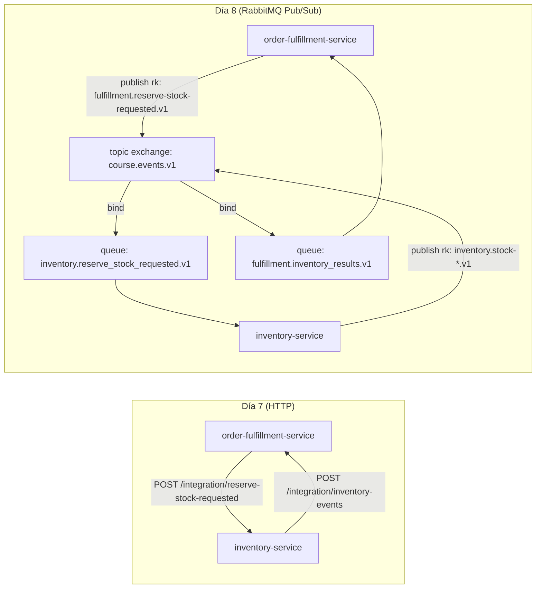

# Día 8 — EDA (Parte 1) · Guía de proyecto (estudiantes)

Partimos del **estado final del día 7**: ya existe un flujo distribuido con **Outbox + Inbox + contratos versionados**, pero el transporte es “punto a punto” (HTTP).

En **día 8**, el objetivo es **mover el transporte a un broker (RabbitMQ)** sin romper lo anterior:

- Se mantiene: dominio + casos de uso + Inbox/Outbox + contratos.
- Cambia: en vez de `fetch(...)` a endpoints de integración, publicamos/consumimos por **pub/sub**.

Estado final de referencia: `.local/dia-08-referencia/`.

Contratos: `artifacts/03-integration-contracts.md`.

## Por qué hacemos esto (conexión con EDA)

En `curso/dia-08/02-eda-fundamentos.md` trabajamos que EDA no es “solo usar un broker”: es separar **eventos** (lo que pasó) de **mensajes** (cómo viajan), y asumir entrega **al menos una vez** con idempotencia.

En día 7, ya resolvimos gran parte de lo difícil:

- durabilidad de publicación (Outbox)
- tolerancia a duplicados (Inbox)
- contratos versionados (Published Language)

Lo que falta para “EDA real” es que los bounded contexts no se llamen directamente: deben hablar a través de un **Event Broker** (RabbitMQ). Eso reduce acoplamiento temporal (si el otro servicio está caído, el flujo no desaparece) y permite escalar consumidores de forma independiente.

### Antes vs después (transporte)



## Topología mínima (RabbitMQ)

- Exchange (topic): `course.events.v1`
- Routing keys:
  - `fulfillment.reserve-stock-requested.v1`
  - `inventory.stock-reserved.v1`
  - `inventory.stock-rejected.v1`
- Queues:
  - `inventory.reserve_stock_requested.v1`
  - `fulfillment.inventory_results.v1`

## Wiring (2 tareas) — conecta primero, implementa después

### Tarea 1 — Wire “Outbox → RabbitMQ” (productores)

Idea: tu Outbox sigue guardando mensajes, pero ahora el “worker” los publica al exchange usando:

- `routingKey = destination` (guardado en la outbox)
- `messageId`/`correlationId` como propiedades AMQP
- confirm channel (`waitForConfirms`) antes de marcar `sent_at`

Esto conecta directamente con `curso/dia-08/02-eda-fundamentos.md`:
- **confirm channel** ≈ “publicación con confirmación” (el broker confirma que aceptó el mensaje)
- **at-least-once**: aunque publiques con confirm, puede haber duplicados → Inbox sigue siendo obligatorio

Boilerplate (en cada servicio, en `main.ts`):

```ts
const publisher = container.resolve("outboxPublisher") // OutboxRabbitPublisher
await publisher.start({ intervalMs: 500 })

app.addHook("onClose", async () => {
  await publisher.stop()
})
```

Archivos a modificar (productores):

- `order-fulfillment-service/src/infra/events/OutboxRabbitPublisher.ts` (nuevo worker: outbox → exchange)
- `order-fulfillment-service/src/infra/messaging/rabbitmq.ts` (helpers: connect/assertExchange/confirm channel)
- `order-fulfillment-service/src/config/config.ts` (agregar `RABBITMQ_URL`, `RABBITMQ_EXCHANGE`)
- `order-fulfillment-service/src/infra/events/OutboxIntegrationEventPublisher.ts` (guardar `destination = routingKey`)
- `order-fulfillment-service/main.ts` (registrar y arrancar el publisher)

- `inventory-service/src/infra/events/OutboxRabbitPublisher.ts` (nuevo worker)
- `inventory-service/src/infra/messaging/rabbitmq.ts` (helpers)
- `inventory-service/src/config/config.ts` (agregar `RABBITMQ_URL`, `RABBITMQ_EXCHANGE`)
- `inventory-service/src/infra/events/InventoryIntegrationEventsPublisher.ts` (guardar `destination = routingKey`)
- `inventory-service/main.ts` (registrar y arrancar el publisher)

### Tarea 2 — Wire “RabbitMQ → Use Case” (consumidores)

Idea: creas un consumer por bounded context, bindeado al exchange con las routing keys correctas, y delegas a tu use case. El use case ya hace idempotencia (Inbox), así que el consumer:

- parsea JSON
- llama `useCase.execute(message)`
- hace `ack` si ok, `nack(requeue=false)` si error (luego DLQ en día 9)

Boilerplate (en cada servicio, en `main.ts`):

```ts
const consumer = container.resolve("consumer") // p.ej. ReserveStockRequestedRabbitConsumer / InventoryResultsRabbitConsumer
await consumer.start()

app.addHook("onClose", async () => {
  await consumer.stop()
})
```

Archivos a modificar (consumidores):

- `inventory-service/src/infra/messaging/ReserveStockRequestedRabbitConsumer.ts`
  - consume `fulfillment.reserve-stock-requested.v1`
  - llama a `inventory-service/src/application/HandleReserveStockRequestedUseCase.ts`
- `inventory-service/main.ts` (registrar/arrancar el consumer)

- `order-fulfillment-service/src/infra/messaging/InventoryResultsRabbitConsumer.ts`
  - consume `inventory.stock-*.v1`
  - llama a `order-fulfillment-service/src/application/HandleInventoryIntegrationEventUseCase.ts`
- `order-fulfillment-service/main.ts` (registrar/arrancar el consumer)

## Implementación (detalles) — lo que debes construir

### A) Publishers (Outbox polling)

1. Añade `amqplib` y config:
   - `RABBITMQ_URL` (default `amqp://localhost`)
   - `RABBITMQ_EXCHANGE` (default `course.events.v1`)
2. Implementa `OutboxRabbitPublisher`:
   - abre conexión + confirm channel
   - `assertExchange(exchange, "topic")`
   - hace polling `getUnsent()`, `publish(...)`, `waitForConfirms()`, `markSent(id)`

### B) Consumers (RabbitMQ)

Implementa un consumer por lado:

- **Inventory** consume `fulfillment.reserve-stock-requested.v1` y llama a `HandleReserveStockRequestedUseCase`.
- **Fulfillment** consume `inventory.stock-*.v1` y llama a `HandleInventoryIntegrationEventUseCase`.

### C) Routing keys desde publishers de integración

Alinea `destination` (outbox) a routing keys:

- Fulfillment publica: `destination = "fulfillment.reserve-stock-requested.v1"`
- Inventory publica: `destination = "inventory.stock-reserved.v1"` o `inventory.stock-rejected.v1`

## Cómo probar (local)

1. Levanta Postgres + RabbitMQ (usa `.local/dia-08-referencia/docker-compose.yaml` como plantilla).
2. Corre ambos servicios (`npm install`, `npm start`).
3. Crea una orden (`POST /orders`) y observa que el flujo progresa por eventos.
