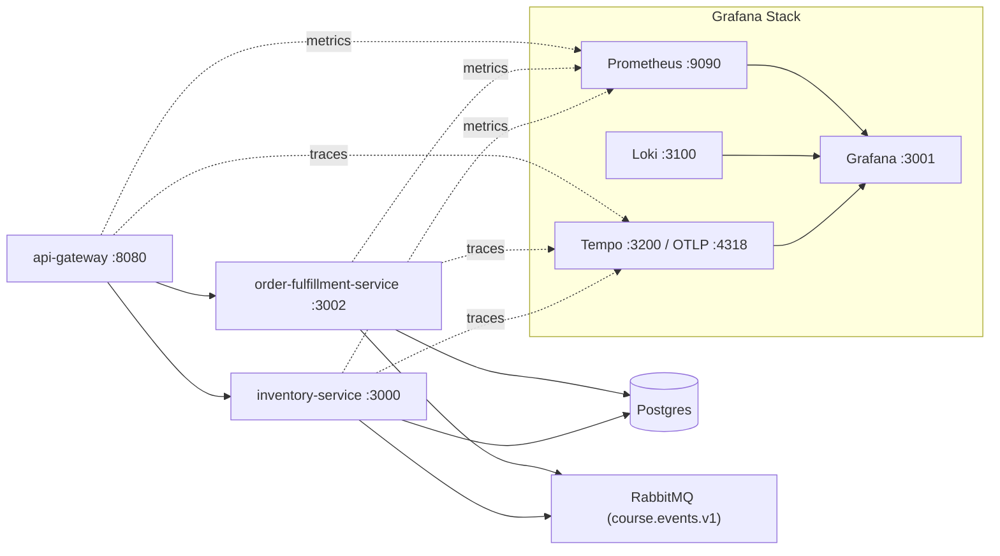
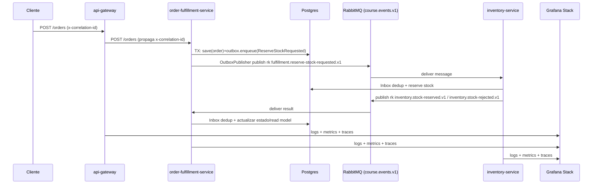

# Proyecto (final operable) — DDD/Hexagonal + EDA + Observabilidad

Este `project/` corresponde al **estado final** alineado con:

- Día 8: Outbox/Inbox + RabbitMQ
- Día 9: DLQ + retry básico (TTL) + idempotencia
- Día 10: Observabilidad (OTel + Prometheus + Loki + Tempo + Grafana) + cierre

Referencia rápida “del curso al código” (por qué DDD/Hex/CQRS/EDA aplican y dónde verlo):

- `project/COURSE-REFERENCE.md`

## Qué vas a levantar (topología)


```mermaid
flowchart LR
  G["api-gateway :8080"] --> F["order-fulfillment-service :3002"]
  G --> I["inventory-service :3000"]

  F --> PG[(Postgres)]
  I --> PG

  F --> MQ["RabbitMQ (course.events.v1)"]
  I --> MQ

  subgraph Obs["Grafana Stack"]
    P["Prometheus :9090"]
    L["Loki :3100"]
    T["Tempo :3200 / OTLP :4318"]
    GF["Grafana :3001"]
  end

  G -. metrics .-> P
  G -. traces .-> T
  F -. metrics .-> P
  I -. metrics .-> P
  F -. traces .-> T
  I -. traces .-> T
  P --> GF
  L --> GF
  T --> GF
```

### Topología RabbitMQ (mínimo viable)

- Exchange (topic): `course.events.v1`
- Routing keys:
  - `fulfillment.reserve-stock-requested.v1`
  - `fulfillment.release-reservation-requested.v1`
  - `inventory.stock-reserved.v1`
  - `inventory.stock-rejected.v1`
- Queues:
  - `inventory.reserve_stock_requested.v1`
  - `inventory.release_reservation_requested.v1`
  - `fulfillment.inventory_results.v1`
- DLX (direct): `course.dlx.v1` + DLQs por cola

## Día 9/10 — Arranque rápido (con datos + tráfico)

Desde la raíz del repo:

```bash
docker compose -f project/docker-compose.yml up -d --build
```

Smoke-check rápido (cuando termina el build):

```bash
curl -fsS http://localhost:8080/health >/dev/null && echo "api-gateway OK"
curl -fsS http://localhost:3002/health >/dev/null && echo "fulfillment OK"
curl -fsS http://localhost:3000/health >/dev/null && echo "inventory OK"
```

Si es la primera vez que levantas el proyecto, Postgres se inicializa con datos semilla.
Además, el `docker-compose.yml` incluye un job `seed-inventory` para asegurar que el inventario mínimo exista (útil si ya tenías un volumen viejo).
Si ya lo levantaste antes y quieres volver a un estado “limpio” (re-ejecutar seeds):

```bash
docker compose -f project/docker-compose.yml down -v
docker compose -f project/docker-compose.yml up -d --build
```

Para **generar tráfico automático** (recomendado en Día 9/10 para ver logs/trazas/métricas sin hacer cURL manual):

```bash
docker compose -f project/docker-compose.yml --profile demo up -d --build
```

Para parar solo el tráfico:

```bash
docker compose -f project/docker-compose.yml --profile demo stop demo-traffic
```

### URLs (copy/paste)

UIs:

- RabbitMQ: `http://localhost:15672` (`guest` / `guest`)
- Grafana: `http://localhost:3001` (anonymous `Admin`)
- Prometheus: `http://localhost:9090` (targets: `http://localhost:9090/targets`)
- Loki (API): `http://localhost:3100`
- Tempo (API): `http://localhost:3200`

Servicios:

- API Gateway: `http://localhost:8080`
- Inventory (HTTP): `http://localhost:3000`
- Fulfillment (HTTP): `http://localhost:3002`

Observabilidad (endpoints):

- API Gateway metrics: `http://localhost:9466/metrics`
- Inventory metrics: `http://localhost:9464/metrics`
- Fulfillment metrics: `http://localhost:9465/metrics`

En esos endpoints verás:

- HTTP: `http_server_requests_total`, `http_server_request_duration_ms_*`
- EDA (RabbitMQ + Outbox): `eda_consumer_messages_total`, `eda_consumer_duration_ms_*`, `eda_outbox_published_total`, `eda_outbox_publish_duration_ms_*`
- Negocio (ejemplo): `orders_placed_total` (en `order-fulfillment-service`)

## Qué “flujo” estamos observando (mapa mental)

Este es el camino feliz que deberías poder seguir en **logs + métricas + trazas**:


```mermaid
sequenceDiagram
  participant C as Cliente
  participant G as api-gateway
  participant F as order-fulfillment-service
  participant PG as Postgres
  participant MQ as RabbitMQ (course.events.v1)
  participant I as inventory-service
  participant Obs as Grafana Stack

  C->>G: POST /orders (x-correlation-id)
  G->>F: POST /orders (propaga x-correlation-id)
  F->>PG: TX: save(order)+outbox.enqueue(ReserveStockRequested)
  F->>MQ: OutboxPublisher publish rk fulfillment.reserve-stock-requested.v1
  MQ->>I: deliver message
  I->>PG: Inbox dedup + reserve stock
  I->>MQ: publish rk inventory.stock-reserved.v1 / inventory.stock-rejected.v1
  MQ->>F: deliver result
  F->>PG: Inbox dedup + actualizar estado/read model
  G->>Obs: logs + metrics + traces
  F->>Obs: logs + metrics + traces
  I->>Obs: logs + metrics + traces
```

## Endpoints HTTP (todas las “rutas del proyecto”)

### API Gateway (`http://localhost:8080`)

- Health:
  - `GET http://localhost:8080/health`
- Orders (BFF):
  - `POST http://localhost:8080/orders`
  - (nota) `GET http://localhost:8080/orders` **NO existe** → Fastify responde `404 Route GET:/orders not found`
  - `GET  http://localhost:8080/orders/:orderId`
  - `GET  http://localhost:8080/orders/:orderId/status`
  - `GET  http://localhost:8080/orders/:orderId/pick-list`
  - `POST http://localhost:8080/orders/:orderId/cancel`
- Inventory (BFF):
  - `GET  http://localhost:8080/inventory/:sku`
  - `POST http://localhost:8080/inventory/:sku/reserve`
  - `POST http://localhost:8080/inventory/:sku/replenish`
  - `POST http://localhost:8080/inventory/:sku/release`

#### Nota: `GET /orders` (sin `:orderId`) devuelve 404

El Gateway **no implementa** listado de pedidos (`GET /orders`). Si lo llamas por error:

```bash
curl -i http://localhost:8080/orders
```

Respuesta esperada:

```json
{
  "message": "Route GET:/orders not found",
  "error": "Not Found",
  "statusCode": 404
}
```

### Inventory Service (`http://localhost:3000`)

- `GET  http://localhost:3000/health`
- `GET  http://localhost:3000/ready`
- `GET  http://localhost:3000/inventory/:sku`
- `GET  http://localhost:3000/inventory?onlyAvailable=true`
- `GET  http://localhost:3000/inventory?sku=:sku`
- `POST http://localhost:3000/inventory/:sku/reserve`
- `POST http://localhost:3000/inventory/:sku/replenish`
- `POST http://localhost:3000/inventory/:sku/release`
- `GET  http://localhost:3000/inventory/reservations/:reservationId`
- (solo para ejercicios) `POST http://localhost:3000/integration/reserve-stock-requested`

### Order Fulfillment Service (`http://localhost:3002`)

- `GET  http://localhost:3002/health`
- `POST http://localhost:3002/orders`
- `GET  http://localhost:3002/orders/:orderId`
- `GET  http://localhost:3002/orders/:orderId/status`
- `GET  http://localhost:3002/orders/:orderId/pick-list`
- `POST http://localhost:3002/orders/:orderId/cancel`
- `POST http://localhost:3002/orders/:orderId/ready-to-ship`
- `GET  http://localhost:3002/orders?status=PENDING`
- (solo para ejercicios) `POST http://localhost:3002/integration/inventory-events`

## gRPC (opcional, comunicación interna)

Puertos:

- Inventory gRPC: `localhost:50051`
- Fulfillment gRPC: `localhost:50052`

Ejemplo con `grpcurl` (si lo tienes instalado):

- `grpcurl -plaintext localhost:50051 course.inventory.v1.InventoryService/GetStock '{"sku":"11111111-1111-1111-1111-111111111111"}'`
- `grpcurl -plaintext localhost:50052 course.fulfillment.v1.FulfillmentService/GetOrder '{"orderId":"ORDER-..."}'`

## Probar el flujo end-to-end (manual, con API Gateway)

> Inventory usa UUID como `sku`. (Se siembra automáticamente al levantar Postgres: `1111...`, `2222...`, `3333...`).

Tip: para poder investigar “un caso” en Grafana, usa siempre `x-correlation-id` (lo usamos como `reqId` y lo propagamos a downstream).

### 1) Crear pedido (publica `ReserveStockRequested` vía Outbox → RabbitMQ)

```bash
C=RES-ORDER-000001

curl -i -X POST http://localhost:8080/orders \
  -H "content-type: application/json" \
  -H "x-correlation-id: $C" \
  -d '{
    "orderId":"ORDER-000001",
    "reservationId":"RES-ORDER-000001",
    "lines":[{"lineId":"LINE-0001","sku":"11111111-1111-1111-1111-111111111111","qty":2}]
  }'
```

### 2) Consultar estado (read model)

```bash
curl -i -H "x-correlation-id: $C" http://localhost:8080/orders/ORDER-000001/status
```

### 3) Consultar inventario (read model)

```bash
curl -i -H "x-correlation-id: $C" http://localhost:8080/inventory/11111111-1111-1111-1111-111111111111
```

### 4) Cancelar (publica `ReleaseReservationRequested` → Inventory libera reservas)

```bash
curl -i -X POST -H "x-correlation-id: $C" http://localhost:8080/orders/ORDER-000001/cancel
```

## Qué archivos mirar si algo falla

- Productores (Outbox → exchange):
  - `project/order-fulfillment-service/src/infra/events/OutboxRabbitPublisher.ts`
  - `project/inventory-service/src/infra/events/OutboxRabbitPublisher.ts`
- Consumers (RabbitMQ → Use Case):
  - `project/inventory-service/src/infra/messaging/ReserveStockRequestedRabbitConsumer.ts`
  - `project/inventory-service/src/infra/messaging/ReleaseReservationRequestedRabbitConsumer.ts`
  - `project/order-fulfillment-service/src/infra/messaging/InventoryResultsRabbitConsumer.ts`
- Observabilidad (OTel + /metrics):
  - `project/inventory-service/src/infra/observability/otel.ts`
  - `project/order-fulfillment-service/src/infra/observability/otel.ts`
- API Gateway:
  - `project/api-gateway/main.ts`

## Grafana / Loki / Tempo (Día 10)

En Grafana `http://localhost:3001`:

- Dashboards:
  - `HTTP Metrics (Course)` (home)
  - `Service Health (Course)`
- Explore → Loki:
  - `{service="inventory-service"}`
  - `{service="order-fulfillment-service"}`
  - por correlación (caso único):
    - `{service="api-gateway"} |= "RES-ORDER-000001"`
- Explore → Tempo:
  - filtra por `service.name=api-gateway`, `service.name=inventory-service` o `service.name=order-fulfillment-service` y abre una traza reciente

Prometheus (para ver rápido “si hay vida”):

```promql
sum by (service) (rate(http_server_requests_total[1m]))
sum by (service, queue, outcome) (rate(eda_consumer_messages_total[1m]))
sum by (service, routing_key, outcome) (rate(eda_outbox_published_total[1m]))
sum by (service, outcome) (rate(orders_placed_total[1m]))
```

RabbitMQ UI (`http://localhost:15672`) para “qué pasó en colas”:

- Queues → revisa `messages ready` en:
  - `inventory.reserve_stock_requested.v1`
  - `inventory.release_reservation_requested.v1`
  - `fulfillment.inventory_results.v1`
- Si algo terminó en DLQ, revisa las `*.dlq` y el header `x-death` para ver el motivo/contador.
