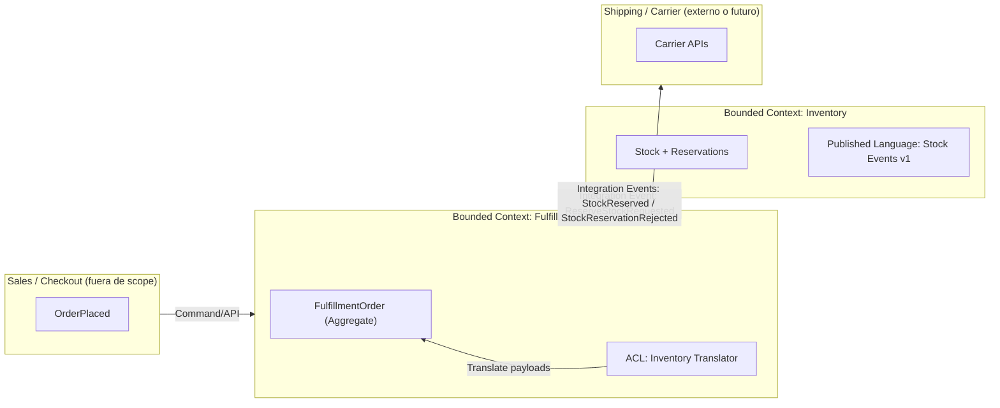

# Bounded Context Canvas (texto) — Fulfillment

## Nombre del contexto

**Fulfillment** (cumplimiento de pedidos)

## Propósito

Convertir un “pedido colocado” en un “pedido listo para envío”, coordinando reservas de stock y agenda de envíos con **consistencia eventual** y trazabilidad completa del estado.

## Actores

- Warehouse Operators
- Customer Support
- Sales Analysts
- Logistics Partners (transportistas)

## Capacidades (responsabilidades)

- Representar el estado del cumplimiento (pedido/líneas).
- Solicitar reservas a Inventario (por API/eventos).
- Confirmar/rechazar reservas y aplicar transiciones del dominio.
- Generar información de picking/packing (a nivel de modelo, no UI).
- Programar envíos (vía integración con logística, fuera de scope hoy).

## No pertenece al contexto

- Ajustar stock (propio de Inventory).
- Precios, descuentos, promociones (otro contexto, p.ej. Sales/Pricing).
- Catálogo y contenidos de producto (Catalog).

## Lenguaje ubicuo (términos clave)

- Fulfillment Order, Line, Reservation (estado), ReadyToShip, PickList, Shipment

## Invariantes (ejemplos)

- Un pedido no puede estar `READY_TO_SHIP` si hay líneas sin reserva confirmada.
- Una confirmación/rechazo de reserva no puede aplicarse dos veces a la misma línea (idempotencia por `lineId` + `reservationId`).

## Integración (contratos)

- Con Inventory (upstream): Published Language por eventos o API.
- Con Shipping (externo): API/eventos (futuro).

