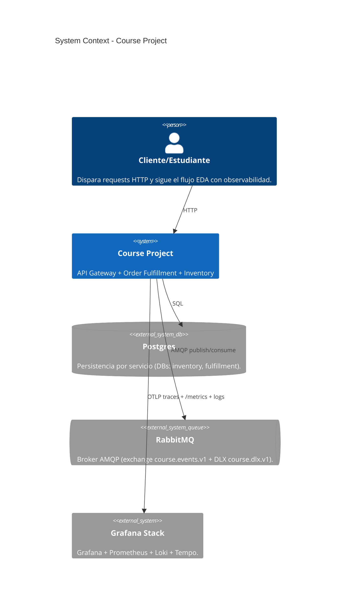
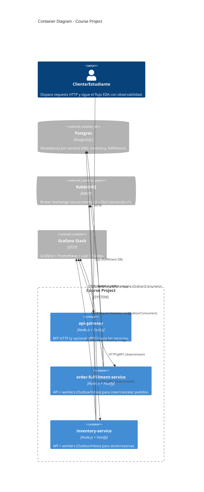

# C4 Diagrams — Curso DDD Hex Node (project/)

C4 diagrams. [Mermaid C4 syntax reference](https://mermaid.js.org/syntax/c4.html).

---

## System Context

```mermaid
C4Context
    title System Context - Course Project

    Person(student, "Cliente/Estudiante", "Dispara requests HTTP y sigue el flujo EDA con observabilidad.")

    System(course_project, "Course Project", "API Gateway + Order Fulfillment + Inventory")

    SystemDb_Ext(postgres, "Postgres", "Persistencia por servicio (DBs: inventory, fulfillment).")
    SystemQueue_Ext(rabbit, "RabbitMQ", "Broker AMQP (exchange course.events.v1 + DLX course.dlx.v1).")
    System_Ext(obs, "Grafana Stack", "Grafana + Prometheus + Loki + Tempo.")

    Rel(student, course_project, "HTTP")
    Rel(course_project, postgres, "SQL")
    Rel(course_project, rabbit, "AMQP publish/consume")
    Rel(course_project, obs, "OTLP traces + /metrics + logs")
```

---

## Container Diagram

```mermaid
C4Container
    title Container Diagram - Course Project

    Person(student, "Cliente/Estudiante", "Dispara requests HTTP y sigue el flujo EDA con observabilidad.")

    System_Boundary(course_project, "Course Project") {
        Container(gateway, "api-gateway", "Node.js + Fastify", "BFF HTTP (y opcional gRPC) hacia los servicios.")
        Container(fulfillment, "order-fulfillment-service", "Node.js + Fastify", "API + workers (Outbox/Inbox) para crear/cancelar pedidos.")
        Container(inventory, "inventory-service", "Node.js + Fastify", "API + workers (Outbox/Inbox) para stock/reservas.")
    }

    ContainerDb_Ext(postgres, "Postgres", "PostgreSQL", "Persistencia por servicio (DBs: inventory, fulfillment).")
    ContainerQueue_Ext(rabbit, "RabbitMQ", "AMQP", "Broker (exchange course.events.v1 + DLX course.dlx.v1).")
    Container_Ext(obs, "Grafana Stack", "OTLP", "Grafana + Prometheus + Loki + Tempo.")

    Rel(student, gateway, "HTTP")
    Rel(gateway, fulfillment, "HTTP/gRPC (downstream)")
    Rel(gateway, inventory, "HTTP/gRPC (downstream)")

    Rel(fulfillment, postgres, "SQL (fulfillment DB)")
    Rel(inventory, postgres, "SQL (inventory DB)")

    Rel(fulfillment, rabbit, "AMQP publish/consume (Outbox/Consumers)")
    Rel(inventory, rabbit, "AMQP publish/consume (Outbox/Consumers)")

    Rel(gateway, obs, "OTLP traces + /metrics + logs")
    Rel(fulfillment, obs, "OTLP traces + /metrics + logs")
    Rel(inventory, obs, "OTLP traces + /metrics + logs")
```
